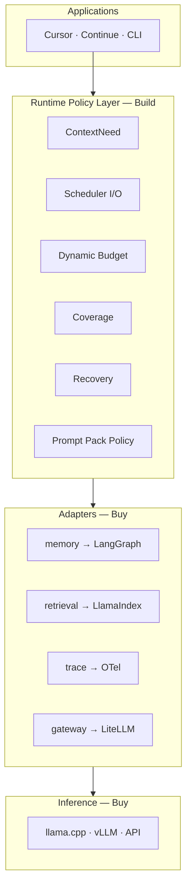
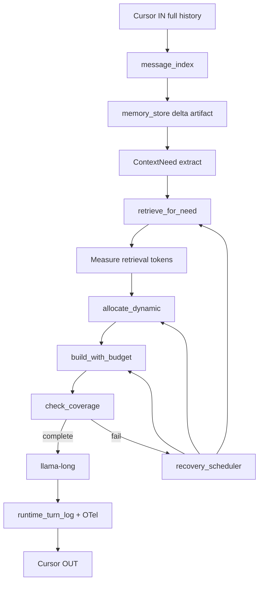
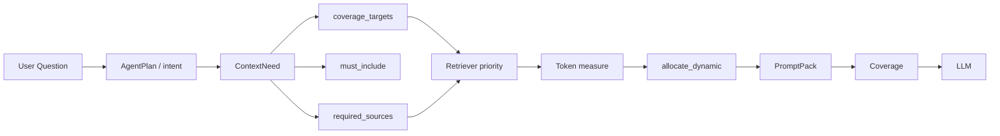
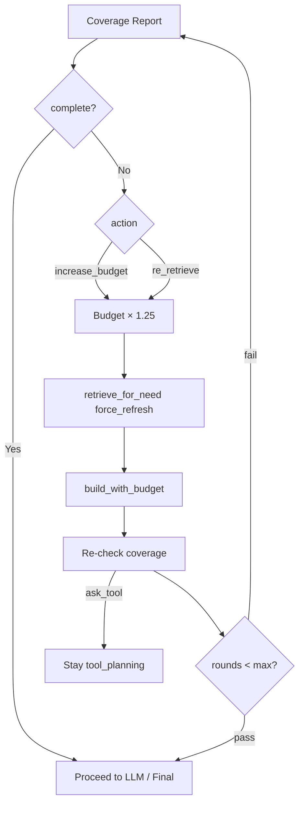
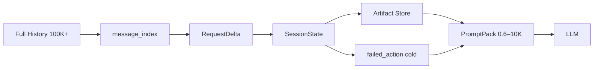
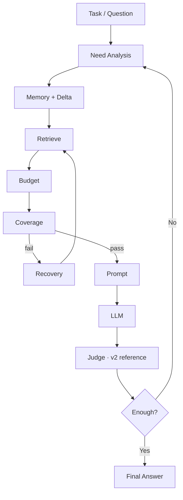
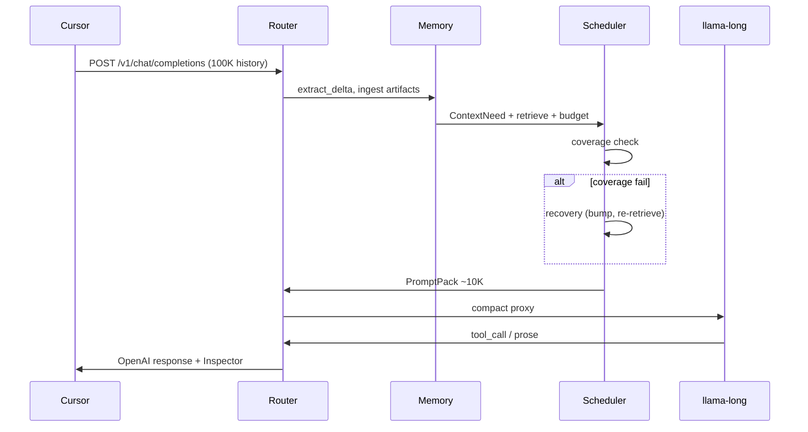

# AI Runtime — Architecture (Technical Reference)

> **제품 정의 · Business · Roadmap** → [VISION.md](./VISION.md)  
> **벤치마크 · 그래프 · 재현** → [BENCHMARK.md](./BENCHMARK.md)  
> **역할**: Cursor ↔ llama.cpp **Middleware** — Context Runtime v1 core + Agent reference (v2)

---

## 목차

1. [Overview](#1-overview)
2. [Runtime Flow — Master Pipeline](#2-runtime-flow--master-pipeline)
3. [Need Analysis → Dynamic Budget](#3-need-analysis--dynamic-budget)
4. [Recovery Loop](#4-recovery-loop)
5. [Memory Layer](#5-memory-layer)
6. [Runtime Closed Loop](#6-runtime-closed-loop)
7. [Module Map](#7-module-map)
8. [Sequence — One Request](#8-sequence--one-request)
9. [Agent Reference Layer (v2)](#9-agent-reference-layer-v2)
10. [API · Inspector · Env](#10-api--inspector--env)
11. [Deployment · Verification](#11-deployment--verification)
12. [Implementation Audit — Code-verified Flow & Issues](#12-implementation-audit--code-verified-flow--issues)

---

## 1. Overview



| 계층 | 책임 | Build/Buy |
|------|------|-----------|
| Application | UI, tool 실행 | — |
| **Policy Layer** | need, budget, coverage, recovery | **Build** |
| **Adapters** | checkpoint, vector, gateway, trace | **Buy glue** |
| Inference | forward, sampling | **Buy** |

Delta policy + dynamic budget → Cursor 100K+ history → LLM **~0.6–10K proxy** (실측 −90%).

### 1.1 Scheduler Contract

```text
Inputs (SchedulerInputs)              Outputs (SchedulerOutputs)
────────────────────────              ──────────────────────────
Intent                                History (session_tail + delta)
Phase                                 Retrieved
Retrieved Tokens (measured)           Artifact
Coverage Score / Complete             Memory (state)
GPU Backend                           Output Tokens
Context Window                        System · Plan · Current Task
Max Output Tokens
Recovery Round
```

`runtime_core/scheduler_contract.py` · wired in `dynamic_context_scheduler.py`

### 1.2 Why each step

| Step | Why |
|------|-----|
| Need | LLM이 이번 턴에 필요한 source·symbol 결정 |
| Retrieve | vector engine(Buy) 결과를 need에 맞게 수집 |
| Measure | 추정이 아닌 실측 token |
| Allocate | 32K window slot 재배치 |
| Coverage | truncate·must_include 검사 |
| Recovery | 부족 시 budget↑ · re-retrieve |

---

## 2. Runtime Flow — Master Pipeline

### 2.1 End-to-end (Context Runtime v1)



### 2.2 19단계 (운영 파이프라인)

```text
[1]  Cursor IN              full history (Router만 수신)
[2]  message_index          stable key diff (append-only | rebuild)
[3]  adapters.memory        delta policy · legacy/LangGraph backend
[4]  failed_action          실패 tool → cold summary
[5]  planner (reference)    AgentPlan — v2 SKU
[6]  adapters.observe       run events · Langfuse + legacy SSE
[7]  ContextNeed            intent preset + merge
[8]  adapters.retrieval     LlamaIndex/BM25 + budget policy
[9]  allocate_dynamic       BudgetPlan (NOT static first)
[10] prompt_builder         PromptPack + truncation markers
[11] coverage_checker       must_include · symbol · truncation
[12] recovery_scheduler     fail → bump → re-retrieve → rebuild
[13] loop_guard             final gate (coverage insufficient)
[14] qwen_request           phase kwargs → llama-long
[15] agent_exec (reference) guard · normalize · leak
[16] evidence layer (v2)    tool → EvidenceItem
[17] evidence_judge (v2)    batch sufficiency
[18] runtime_inspector      chat <details> Budget/Coverage
[19] Cursor                 local tool exec → loop
```

### 2.3 Static vs Dynamic Budget

**POC 한계 (static)**: phase별 고정 비율 — recall/bugfix에 동일 비율 적용.

**Runtime (dynamic)**: 순서가 다르다.

```text
❌ Budget 고정 → Retrieve → truncate blindly
✅ Need → Retrieve → Measure → Allocate → Coverage → Recovery
```

---

## 3. Need Analysis → Dynamic Budget

### 3.1 Need Analysis Flow



### 3.2 ContextNeed 스키마

| 필드 | 역할 |
|------|------|
| `intent` | bugfix · recall · doc_summary · architecture · code_edit |
| `required_sources` | retrieved_code · tool_result · session |
| `must_include` | current user request · latest tool result · agent plan |
| `coverage_targets` | `file.py` · `file.py::symbol` |
| `priority` | 슬롯 가중치 (retrieved vs session_tail vs artifact) |

Intent preset 5종 — `router/context_need.py`

### 3.3 Measure → Allocate

```text
Retriever returns: planner 1200 + memory 800 + benchmark 600 = 2600 tokens measured

allocate_dynamic():
  retrieved  ← f(measured, intent, phase)
  session_tail ← recall intent ↑
  artifact   ← architecture ↑
  output_reserved ← phase max_tokens
```

| Intent | session_tail | retrieved | artifact |
|--------|:------------:|:---------:|:--------:|
| recall | **↑** | ↓ | — |
| bugfix | ↓ | **↑** | ↑ |
| doc_summary | — | — | **↑** |

구현: `router/context_budget.py` · `router/dynamic_context_scheduler.py`

### 3.4 Coverage Check

truncate는 필연적이다. Runtime은 **잘렸는지 안다.**

| 검사 | 내용 |
|------|------|
| must_include | current task · tool result · agent plan |
| symbol | `context_budget.py::allocate_dynamic` |
| truncation | critical source lost_tokens |
| evidence | evidence_needed vs collected |

`action`: `proceed` | `re_retrieve` | `increase_budget` | `ask_tool`

---

## 4. Recovery Loop

### 4.1 Flow



### 4.2 Recovery Scheduler

```text
Coverage Fail
    ↓
Budget + (RECOVERY_BUDGET_BUMP=1.25)
    ↓
Re-Retrieve (section / artifact / vector)
    ↓
Prompt Rebuild
    ↓
Coverage Re-check
    ↓
Pass → final allowed · Fail → loop_guard blocks
```

| env | default |
|-----|---------|
| `RECOVERY_ENABLED` | `1` |
| `MAX_RECOVERY_ROUNDS` | `2` |
| `COVERAGE_THRESHOLD` | `0.75` |

E2E: `scripts/benchmark-recovery-e2e.py` — before 0.36 → after 1.00 ✅

---

## 5. Memory Layer — LLM Memory Hierarchy

> **핵심**: Context 압축이 아니라 **Memory Hierarchy** — full history는 cold storage, GPU에는 working set만.

### 5.0 Hierarchy funnel

```text
raw history (Cursor)  →  stored memory (session/artifact/vector/policy)
                     →  retrieved (this turn)  →  prompt pack  →  GPU context
```

| 단계 | 모듈 | tier |
|------|------|------|
| Memory Ingest | `adapters.memory` · `legacy/memory_store` | session + artifact |
| Memory Tiering | `runtime_core/memory_policy.py` | hot/cold · GPU exclusion |
| Retrieval Fetch | `adapters.retrieval` | vector |
| Working Set | `adapters.memory.build_working_set()` | gpu_hot |
| Metrics | `runtime_core/memory_hierarchy.py` | funnel snapshot |

`memory.hierarchy.snapshot` OTel event · Inspector funnel · Langfuse `runtime_turn.memory_hierarchy`

**Quality gate** (`scripts/benchmark-memory-hierarchy.py --quality-gate`):

| Gate | Threshold | Measured |
|------|-----------|----------|
| raw→GPU ratio | ≤ 0.05 | 0.018 max |
| coverage_score | ≥ 0.8 | 1.00 min |
| task_success | ≥ 95% | 100% |
| recovery_success | ≥ 95% | 100% |
| repeated_read_avoidance | ≥ 70% | 100% |

Cases: bugfix (`file.py::symbol`) · explore (artifact + tool) · recall (session hit) · doc_analysis (section) · recovery (fail→re-retrieve→pass). Fail breakdown: `coverage_fail_reason` (`need_missing` · `retrieval_miss` · `budget_truncation` · `prompt_exclusion` · `latest_tool_missing` · `symbol_missing`).

**Evidence cluster (re-read dedup)**: `runtime_core/evidence_keys.py` · `runtime_core/evidence_cluster.py` — canonical path/symbol/range keys · Read/Grep/range/tool → one cluster · recovery skips full re-read · benchmark `scripts/benchmark-repeated-read-avoidance.py` (live ≥ 0.90 · stress ≥ 0.80).

**Memory backend swap**: `MEMORY_BACKEND=legacy|langgraph` · `integrations/langgraph_memory.py` · `scripts/benchmark-memory-backend-swap.py` — 동일 quality/re-read gate.

**1-page diagram**: [`assets/context-runtime-1page.mmd`](./assets/context-runtime-1page.mmd)

### 5.1 History → Prompt Pack



### 5.2 Hot / Cold

| 계층 | Hot (매 turn) | Cold |
|------|---------------|------|
| 메시지 | delta + artifact tail | message_keys snapshot |
| index | incremental build | full rebuild |
| 실패 tool | `[failed_tool_actions]` | summaries map |
| phase | PhaseState events | scan fallback |

### 5.3 Retriever + Vector (optional)

```text
retrieve_for_need()
  ├─ artifact score (query · delta · path)
  ├─ vector_retrieve (BM25 or LlamaIndex)  VECTOR_RETRIEVAL=1
  └─ rank_by_need + budget ceiling
```

E2E corpus: 115 artifacts — `bash scripts/run-vector-e2e.sh`

---

## 6. Runtime Closed Loop

Context Runtime v1의 **정체성** — Coverage 기반 폐쇄 루프.



### Judge 3층 (v2 reference — `reference/evidence_judge.py`)

```text
Static pre-eval  → coverage, repeat, budget, leak
LLM Judge        → “답 가능한가?” + next_actions
Runtime guard    → should_block_final_answer
```

---

## 7. Module Map

### 7.1 4-tier (Build / Buy / Legacy / Reference)

```text
runtime_core/     Build — need · budget · coverage · recovery · scheduler_contract
adapters/         Buy glue — memory · retrieval · gateway · trace · observe
legacy/           POC isolation — memory_store · retriever · agent_runs · optimizers
reference/        v2 Agent POC — planner · judge · loop_guard
integrations/     llamaindex · otel · langfuse low-level
```

### 7.2 Runtime Core (Build — Context Runtime v1 SKU)

| Module | Path | IP |
|--------|------|:--:|
| ContextNeed | `context_need.py` | ★★★★★ |
| BudgetPlan | `context_budget.py` | ★★★★★ |
| Coverage | `coverage_checker.py` | ★★★★★ |
| Recovery | `recovery_scheduler.py` | ★★★★★ |
| Scheduler contract | `runtime_core/scheduler_contract.py` | ★★★★★ |
| Orchestrator | `dynamic_context_scheduler.py` | ★★★★★ |
| PromptPack policy | `prompt_builder.py` | ★★★★☆ |
| Message index | `message_index.py` | ★★★☆☆ |
| Turn log | `runtime_turn_log.py` | ★★☆☆☆ |

### 7.3 Adapters (Buy glue)

| Adapter | Buy target | Legacy fallback |
|---------|------------|-----------------|
| `adapters/memory.py` | LangGraph checkpointer | `legacy/memory_store.py` |
| `adapters/retrieval.py` | LlamaIndex | `legacy/retriever.py` BM25 |
| `adapters/gateway.py` | LiteLLM | direct httpx |
| `adapters/trace.py` | OpenTelemetry | optional JSON |
| `adapters/observe.py` | Langfuse | `legacy/agent_runs.py` SSE |

### 7.4 Reference (Agent Runtime v2 — Cursor POC)

| Module | Path |
|--------|------|
| Planner | `reference/planner.py` |
| Plan guard | `reference/plan_state.py` |
| Executor | `reference/agent_exec.py` |
| Judge | `reference/evidence_judge.py` |
| Loop guard | `reference/loop_guard.py` |

상세 tier → [MODULE_MAP.md](./MODULE_MAP.md)

---

## 8. Sequence — One Request



OTel: `integrations/flow_tracing.py` — cursor_in → router_proxy → llm_response

---

## 9. Agent Reference Layer (v2)

Cursor agent 안정화용 — v1 SKU 필수 아님.

```text
ensure_agent_plan() → AgentPlan
    ↓
prompt_builder [Saved Agent Plan]
    ↓
LLM tool_call
    ↓
validate_tool_call() / read_guard
    ↓
evidence_extractors → evidence_collected
    ↓
evidence_judge → final_ready | tool_planning
    ↓
loop_guard → should_block_final_answer
```

환경: `PLANNER_MODE=rule|llm|hybrid` · `EVIDENCE_JUDGE_ENABLED=1`

---

## 10. API · Inspector · Env

### 10.1 Agent Run Trace

| Method | Path |
|--------|------|
| GET | `/router/agent/runs` |
| GET | `/router/agent/runs/{id}/events` (SSE) |

### 10.2 Runtime Inspector

Budget · Coverage · Recovery · ContextNeed — `runtime_inspector.py`  
SSE chunk: `Runtime · phase · cov 0.82 · blocked:reason`

### 10.3 핵심 환경 변수

| 변수 | default | 설명 |
|------|---------|------|
| `DYNAMIC_BUDGET` | `1` | dynamic scheduler |
| `COVERAGE_CHECK` | `1` | coverage + recovery |
| `RECOVERY_ENABLED` | `1` | recovery loop |
| `VECTOR_RETRIEVAL` | `0` | vector merge in retriever |
| `OTEL_FLOW_TRACE` | `1` | OTel 3-stage spans |
| `MEMORY_STORE` | `1` | delta + artifact |
| `CURSOR_RUNTIME_INSPECTOR` | `1` | chat details UI |

전체 env → 하단 Legacy 섹션 · [INTEGRATIONS.md](./INTEGRATIONS.md)

---

## 11. Deployment · Verification

### 11.1 Unified Topology

```text
Cursor → Router (Context Runtime + reference agent)
              → llama-long ONLY (Qwen3.6-27B + mmproj)
                    ├─ /v1/chat/completions
                    └─ /router/agent/runs/{id}/events
```

### 11.2 Context Policy

| | 값 |
|--|-----|
| 운영 ctx | **32K** |
| 실험 | 200K only |

### 11.3 검증 명령

```bash
python3 scripts/benchmark-dynamic-budget-matrix.py   # 25 cases
python3 scripts/benchmark-recovery-e2e.py
bash scripts/run-vector-e2e.sh
python3 scripts/benchmark-runtime-score.py --tasks 30
python3 scripts/test-runtime-inspector.py
```

| 지표 | 목표 | p1 |
|------|:----:|:--:|
| Runtime success | ≥95% | **100%** |
| Context proxy | −80% | **−90%** |
| Recovery E2E | pass | ✅ |

벤치 전체 → [BENCHMARK.md](./BENCHMARK.md)

### 11.4 Fallback Profile

`qwen3_6_27b` → `qwen3_coder` (장애 시)

---

## 12. Implementation Audit — Code-verified Flow & Issues

> **2026-06-22 전수조사** — `router/` 66개 Python 모듈을 진입점(`main.py`)부터 leaf까지 추적.  
> 목적: 문서상 19단계와 **실제 호출 경로** 정렬, 중복·과분할·dead path 식별.

### 12.1 실제 요청 경로 (코드 기준)

```mermaid
flowchart TD
    subgraph ingress["Tier 4 — Ingress"]
        MAIN[main.py ProxyHandler._proxy]
        CAP[capture.py]
        VL[vl_pass.py optional]
        NORM[normalize_messages_for_coder/multimodal]
    end
    subgraph pass1["Tier 4 — Two-Pass Orchestration"]
        TP[intent_router.process_two_pass]
        RAW[context_cache.save_raw_payload]
        ING[adapters.memory.ingest_request → legacy/memory_store]
        IDX[context_cache.build_context_index + message_index]
        CLS[intent_router.classify_intent]
        BP[intent_router.build_proxy_body]
    end
    subgraph branch{"should_use_memory_body?"}
        MEM[prompt_builder.build_memory_proxy_body]
        LEG[intent_router.build_context_pack — legacy string pack]
    end
    subgraph runtime["Tier 0 — Context Runtime v1"]
        DCS[dynamic_context_scheduler.build_context_for_turn]
        NEED[context_need.extract_context_need]
        RET1[adapters.retrieval.retrieve_for_need ×2]
        BUD[context_budget.allocate_dynamic]
        PB[prompt_builder.build_with_budget]
        COV[coverage_checker.check_coverage]
        REC[recovery_scheduler.RecoveryScheduler.recover]
        LG[reference.loop_guard.should_block_final_answer]
    end
    subgraph agent["Tier 3 — Agent Reference v2"]
        PLAN[reference.planner.ensure_agent_plan]
        PS[reference.plan_state.resolve_agent_phase]
        EXEC[reference.agent_exec.postprocess_agent_response]
        JUDGE[reference.evidence_judge — optional]
    end
    subgraph egress["Egress"]
        GW[adapters.gateway.chat_completion]
        INS[runtime_inspector.inject_runtime_inspector]
        GUARD[reference.response_guard.apply_nonempty_guard]
        OBS[adapters.observe.finish_run + adapters.trace.record_response]
    end

    MAIN --> CAP --> VL --> NORM --> TP
    TP --> RAW --> ING --> IDX --> CLS --> BP
    BP --> branch
    branch -->|yes MEMORY_STATE_BODY=1| MEM --> DCS
    branch -->|no| LEG
    DCS --> PLAN --> NEED --> RET1 --> BUD --> PB --> COV
    COV -->|fail| REC --> RET1
    COV --> LG
    MEM --> PB
    BP --> PS
    TP --> GW
    GW --> EXEC --> INS --> GUARD --> OBS
```

**한 줄 요약**: Cursor 100K → `process_two_pass`에서 delta/artifact ingest → (대부분) `build_context_for_turn` dynamic pipeline → compact proxy → llama → `postprocess_agent_response` + inspector.

### 12.2 모듈별 실제 역할 (66 files → 6 clusters)

| Cluster | 파일 수 | 실제 책임 | 호출 주체 |
|---------|:------:|-----------|-----------|
| **Ingress** | 6 | HTTP, VL, capture, chat_fast | `main.py` |
| **Two-pass** | 4 | intent, legacy pack, index | `intent_router.py` |
| **Runtime Core (Build)** | 12 | need, budget, coverage, recovery, scheduler, prompt pack | `dynamic_context_scheduler.py` |
| **Adapters (Buy glue)** | 7 | memory/retrieval/gateway/trace/observe thin wrap | orchestrators |
| **Legacy backends** | 5 | file store, BM25 retriever, agent_runs SSE | adapters only |
| **Reference Agent (v2)** | 16 | planner, phase, tool exec, evidence, read_only explorer | `agent_exec`, `planner` |
| **Integrations** | 4 | OTel, Langfuse, LlamaIndex, LangGraph | adapters |
| **Support** | 12 | message_index, artifact_excerpt, failed_action, inspector, turn_log | scattered |

### 12.3 Turn 내부 micro-flow (Dynamic path — default)

`DYNAMIC_BUDGET=1` · `MEMORY_STATE_BODY=1` · agent/exec intent일 때:

```text
[1] ingest_request(req_id, body)
      legacy/memory_store: resolve_session → extract_delta → index messages
      → save artifacts (tool/file) → update SessionState → persist JSON

[2] build_context_index(body, req_id, state, delta)
      context_cache + runtime_core/indexing_helpers + message_index

[3] classify_intent(query, index)          ← router intent (casual|code_edit|agent|…)
      keyword score table in intent_router.py

[4] build_proxy_body → should_use_memory_body → build_memory_proxy_body
      → build_context_for_turn()

[5] ensure_agent_plan(state, query)        ← reference/planner.py (rule|llm|hybrid)
      → AgentPlan dict → state.agent_plan

[6] extract_context_need(plan, query, router_intent, phase)
      ← context_need.py (bugfix|recall|architecture|… preset)

[7] retrieve_for_need(preliminary ~2048 tok)   ← legacy/retriever.py via adapters/retrieval
[8] allocate_dynamic(backend, phase, max_out, need, stats)
[9] retrieve_for_need(final retrieved budget)  ← **2nd retrieval pass**
[10] build_with_budget(...) → PromptPack
[11] check_coverage(need, retrieval_pack, pack, evidence_*)
[12] recovery loop (optional, max 2 rounds)
[13] loop_guard.should_block_final_answer → state.last_runtime_turn
[14] enforce_prompt_budget (runtime_core/prompt_enforcer)
[15] gateway → LLM
[16] postprocess_agent_response (tool normalize, synthetic tool, evidence ingest)
[17] runtime_inspector + response_guard
```

**Legacy path** (`should_use_memory_body=false` 또는 `DYNAMIC_BUDGET=0`):

```text
build_proxy_body → build_context_pack (string sections)
  OR build_simple_chat_body (casual)
  OR final_answer session tail copy (last_role=tool)
→ enforce_prompt_budget
```

casual/explain·MEMORY_STATE_BODY off일 때만 legacy pack이 살아 있음.

### 12.4 Phase 결정 — 3곳에서 각각 판단 (중복 핵심)

| Layer | Module | Input | Output |
|-------|--------|-------|--------|
| A | `plan_state.PhaseState` | indexed messages events | `current_phase`, `final_ready` |
| B | `plan_state.resolve_agent_phase` | body + state + intent | `tool_planning` \| `final_answer` \| … |
| C | `planner.ensure_agent_plan` | query + evidence | `final_ready`, `next_action`, `evidence_needed` |

`build_proxy_body`는 B를, `build_context_for_turn`은 planner의 C를, `postprocess_agent_response`는 다시 planner/plan_state를 호출. **단일 phase FSM 없음**.

### 12.5 Intent 3중 체계 (혼동·버그 원인)

| 이름 | 모듈 | 값 예 | 용도 |
|------|------|-------|------|
| **router_intent** | `intent_router.classify_intent` | `code_edit`, `read_only_analysis`, `casual` | backend route, tools policy, legacy pack |
| **context_intent** | `context_need.resolve_context_intent` | `bugfix`, `architecture`, `recall` | budget preset, coverage targets |
| **task_intent** | `planner.AgentPlan.task_intent` | `project_inspection`, `benchmark_analysis` | evidence_needed, tool policy |

매핑은 부분적 (`TASK_INTENT_MAP`, keyword heuristics). 동일 user query에 세 intent가 다를 수 있음.

### 12.6 Memory / Retrieval 실제 wiring

```text
adapters/memory.py
  └─ type alias + langgraph switch
  └─ legacy/memory_store.py  ← 실제 ingest, delta, artifact, SessionState (~1400 LOC)

adapters/retrieval.py
  └─ 1-line passthrough
  └─ legacy/retriever.py     ← BM25 + artifact score + optional vector (VECTOR_RETRIEVAL)

integrations/llamaindex.py   ← VECTOR path when LLAMAINDEX_ENABLED=1
runtime_core/evidence_cluster.py + evidence_keys.py  ← re-read dedup in recovery
runtime_core/memory_hierarchy.py  ← funnel metrics (OTel + inspector)
```

`adapters/memory.build_working_set()` · `runtime_core/memory_policy.py`는 **benchmark/quality gate**에서 주로 사용; hot path ingest는 `legacy/memory_store.ingest_request`가 담당.

### 12.7 Agent Reference layer micro-flow (v2)

```text
ensure_agent_plan (planner.py)
  ├─ rule/llm/hybrid task_intent + next_action
  ├─ source_registry + target_coverage (read_only)
  └─ read_only_explorer (LLM next tool) when READ_ONLY_EXPLORER_ENABLED

postprocess_agent_response (agent_exec.py) — LLM 응답 후
  ├─ validate_tool_call / read_guard
  ├─ evidence_extractors → evidence_collected
  ├─ plan_state.refresh / planner updates
  ├─ evidence_judge (EVIDENCE_JUDGE_ENABLED)
  └─ loop_guard gates (ping_pong, coverage, final count)

loop_guard.should_block_final_answer  ← scheduler 종료 + postprocess 양쪽
```

Reference 16모듈 중 **hot path**: `planner`, `plan_state`, `agent_exec`, `loop_guard`, `target_coverage`, `read_only_explorer`.  
나머지(`evidence_store`, `answer_tokens`, `project_root` 등)는 planner/agent_exec의 helper.

### 12.8 Observability 실제 경로

```text
adapters/trace.py          → integrations/flow_tracing.py (OTel 3-stage: in/proxy/out)
adapters/observe.py        → integrations/langfuse.py OR legacy/agent_runs.py (SSE)
runtime_core/runtime_events.py  ← event schema (turn_start, need_created, …)
runtime_turn_log.py        ← state.last_runtime_turn persistence
runtime_inspector.py       ← chat <details> in response
explorer_trace.py          ← read_only explorer NDJSON (dev)
```

동일 turn이 **OTel + Langfuse/SSE + turn_log + inspector** 4곳에 기록 — schema는 `runtime_events`로 통일 시도 중이나 consumer는 분산.

---

### 12.9 🔴 중복 · 불일치 (확인됨)

| ID | 문제 | 위치 | 영향 |
|:--:|------|------|------|
| **D1** | `extract_recent_agent_tail`, `extract_original_system` **동일 구현 2벌** | `intent_router.py` ↔ `prompt_builder.py` | drift 위험, 유지비 2× |
| **D2** | `TOOL_PLANNING_MAX_TOKENS` default **400 vs 800** | `intent_router` vs `prompt_builder`/`dynamic_context_scheduler` | legacy path와 dynamic path max_tokens 불일치 |
| **D3** | `EXEC_INTENTS` vs `EXEC_CONTEXT_INTENTS` **집합 다름** | `agent_exec` 4개 vs `prompt_builder` 6개+ | stream/tools/session tail 정책 엇갈림 |
| **D4** | **Intent 3중 체계** (§12.5) | router / context_need / planner | coverage target·budget·tool policy 불일치 |
| **D5** | **Plan 2블록** prompt 주입 | `format_saved_agent_plan_block` + `format_plan_state_block` | plan+legacy_plan이 system cap 경쟁 → evidence truncation |
| **D6** | `retrieve_for_need` **턴당 2회** (preliminary + post-budget) | `dynamic_context_scheduler.py` L161–221 | latency·I/O 2×; 1-pass measure+allocate로 합칠 여지 |
| **D7** | `inject_memory_context` **사실상 no-op** | `prompt_builder.py` L1024 | dead API; 호출만 남음 |
| **D8** | `adapters/retrieval.py` **passthrough 1줄** | adapters/retrieval | tier 분리 이점 없음, indirection만 추가 |
| **D9** | Coverage gate **2곳** | scheduler `check_coverage` + `loop_guard` + optional `evidence_judge` | 동일 fail에 다른 action 가능 |
| **D10** | `legacy/context_optimizer.py`, `runtime_optimizer.py` **import 0** | legacy/ | dead code; MODULE_MAP에는 migrate 대상으로만 기재 |
| **D11** | `build_context_pack` (legacy string) vs `build_with_budget` (PromptPack) **병렬 존재** | intent_router vs prompt_builder | casual 제외 대부분 memory path지만 fallback·테스트 경로 혼란 |
| **D12** | Phase FSM **분산** (§12.4) | plan_state + planner + agent_exec | final_answer 조기/지연, partial_final 탈출 버그 재발 패턴 (handoff 참조) |

### 12.10 🟡 과분할 · 비효율 (구조적)

| ID | 패턴 | modules | 왜 비효율적인가 | 통합 후보 |
|:--:|------|---------|----------------|-----------|
| **F1** | Reference agent **16-file fan-out** | planner, plan_state, source_*, evidence_*, loop_guard, … | 단일 turn에 5–8 import chain; read_only만 4모듈 | `agent/` package with `phase.py`, `tools.py`, `evidence.py` 3-file |
| **F2** | Adapter **thin wrap without interface** | memory, retrieval, langgraph | legacy 직접 import도 adapter 밖에서 발생 (`retriever→memory_store`) | adapter = sole boundary OR legacy 흡수 |
| **F3** | **runtime_core/** 8 modules, orchestrator는 router root | scheduler_contract vs dynamic_context_scheduler | contract types가 decision loop에 미반영 (기록용) | contract → scheduler 내부로 merge 또는 feedback wire |
| **F4** | Indexing **3 layers** | message_index, indexing_helpers, context_cache | 동일 message kind 분류가 3곳 | `message_index` 단일 SSOT |
| **F5** | Tracing **4 sinks** | trace, observe, turn_log, inspector | 동일 turn 4× serialize | `runtime_events` → fan-out 1 emitter |
| **F6** | `artifact_analyzer` + `artifact_excerpt` + retriever scoring | 3-stage excerpt | final_answer rebuild path 복잡 (handoff 2026-06-21) | excerpt pipeline 단일 `artifact_pipeline.py` |
| **F7** | `main.py` **1150 LOC** — HTTP + agent postprocess + ctx overflow retry | ingress + egress 혼재 | 테스트·변경 어려움 | `handlers/chat.py`, `handlers/agent_runs.py` split |

### 12.11 🟢 잘 분리된 부분 (유지 권장)

| Module | 이유 |
|--------|------|
| `dynamic_context_scheduler.py` | turn orchestration SSOT — need→retrieve→budget→coverage→recovery 한 함수 |
| `context_need.py` + `context_budget.py` + `coverage_checker.py` + `recovery_scheduler.py` | Context Runtime v1 IP 경계 명확 |
| `message_index.py` | stable key / kind — memory_store·plan_state가 공유 |
| `adapters/gateway.py` | LiteLLM/httpx 분리 — engine swap 용이 |
| `runtime_core/runtime_events.py` | event schema 중앙화 (consumer 분산만 정리 필요) |
| `reference/read_only_explorer.py` | read_only 전용 — planner와 역할 분리는合理 |

### 12.12 권장 정리 우선순위

```text
P0 (버그/불일치)
  D2 TOOL_PLANNING_MAX_TOKENS 단일 상수
  D3 EXEC_INTENTS 단일 정의 (agent_exec → shared)
  D4 router_intent → context_intent 매핑 테이블 1곳

P1 (latency/중복)
  D6 retrieval 2-pass → measure from artifact meta without full retrieve
  D1 extract_* helpers → prompt_builder SSOT, intent_router import
  D5 plan block 단일화 (AgentPlan OR PhaseState, not both in prompt)

P2 (구조)
  D10 legacy optimizer 삭제 또는 archive/
  F7 main.py handler split
  F5 tracing single emitter

P3 (장기)
  F1 reference/ agent package consolidation
  D11 legacy build_context_pack 제거 (casual만 simple_chat)
```

### 12.13 환경 변수 — 실제 분기점

| 변수 | default | 실제 분기 |
|------|---------|-----------|
| `TWO_PASS_ROUTER` | `1` | off → chat_fast 또는 raw proxy |
| `MEMORY_STATE_BODY` | `1` | off → legacy string pack |
| `DYNAMIC_BUDGET` | `1` | off → allocate_static only |
| `COVERAGE_CHECK` + `RECOVERY_ENABLED` | `1` | recovery loop |
| `PLANNER_MODE` | `rule` | llm/hybrid → extra LLM call in planner |
| `READ_ONLY_EXPLORER_ENABLED` | `1` | synthetic tool injection |
| `EVIDENCE_JUDGE_ENABLED` | `0` | postprocess LLM judge |
| `ROUTER_EXCLUSIVE` | `1` | docker fast/long swap |
| `VECTOR_RETRIEVAL` / `LLAMAINDEX_ENABLED` | `0` | retriever backend |

### 12.14 파일 → Pipeline step 매핑 (quick ref)

| Step (§2.2) | Primary module | Notes |
|:--:|----------------|-------|
| 1 | `main.py` | HTTP ingress |
| 2 | `message_index.py` | via memory_store ingest |
| 3 | `adapters/memory` → `legacy/memory_store` | delta + artifact |
| 4 | `failed_action.py` | cold summary in ingest |
| 5 | `reference/planner.py` | AgentPlan |
| 6 | `adapters/observe.py` | run events |
| 7 | `context_need.py` | ContextNeed |
| 8 | `adapters/retrieval` → `legacy/retriever` | |
| 9–12 | `context_budget` + `dynamic_context_scheduler` + `recovery_scheduler` | |
| 10 | `prompt_builder.py` | PromptPack |
| 11 | `coverage_checker.py` | |
| 13 | `reference/loop_guard.py` | |
| 14 | `adapters/gateway.py` + `qwen_request.py` | engine kwargs |
| 15 | `reference/agent_exec.py` | |
| 16–17 | `reference/evidence_*.py` | v2 optional |
| 18 | `runtime_inspector.py` | |
| 19 | Cursor client | tool exec external |

### 12.15 VISION.md vs 구현 Gap (설계 의도 대조)

> **2026-06-22** — [VISION.md](./VISION.md) 주장을 코드·운영 env와 대조.  
> 등급: 🔴 **의도와 전혀 다름** · 🟠 **부분 구현/형태 다름** · 🟢 **일치**

#### 🔴 설계 의도와 전혀 다른 부분

| # | VISION 주장 | 실제 구현 | Gap |
|:-:|-------------|-----------|-----|
| **V1** | **Pipeline 순서**: Need → Retrieve → Measure → Allocate → **Coverage → Recovery → Prompt** → LLM (§4.3) | `build_context_for_turn`: Need → Retrieve → Budget → Retrieve → **Prompt → Coverage → Recovery** | Coverage가 prompt **이후** — truncate를 prompt build가 먼저 하고, coverage는 사후 감사 |
| **V2** | **Working Set Builder**가 Memory Fetch와 Budget 사이 독립 단계 (§1.1, §4.1) | `build_working_set()`는 `collect_hierarchy_snapshot()`(메트릭)에서만 호출; prompt 조립 hot path 없음 | Hierarchy **개념**은 있으나 WS selection은 `prompt_builder`에 암묵적 — VISION diagram의 독립 계층 아님 |
| **V3** | **Need Analysis = LLM이 이번 턴 필요 source 결정** (§4.1b) | `context_need.py` **rule preset** (keyword → bugfix/recall/…); LLM merge는 `PLANNER_MODE=llm\|hybrid` + planner의 context_need만 (default **rule**) | "LLM-driven need"는 마케팅 문구 수준; v1 SKU는 rule-based |
| **V4** | **v1 / v2 분리** — Agent layer `reference/` ▶ v2 (§9.3) | agent/exec intent **매 turn** `planner` + `plan_state` + `agent_exec` + `loop_guard` hot path | v2 reference가 v1 Cursor POC의 **필수 경로** — 분리 X |
| **V5** | **Agent State Graph = Buy (LangGraph)** (§3, INTEGRATIONS) | LangGraph = optional **memory checkpoint** only (`MEMORY_BACKEND=langgraph`, default **legacy JSON**); agent FSM은 custom `reference/` 16모듈 | "LangGraph 위 policy"가 아니라 "LangGraph 또는 file store 위 custom agent" |
| **V6** | **Universal middleware** — Cursor·VSCode·JetBrains·CLI plugin (§5, §9.2) | Cursor 전용: `<user_query>` 파싱, docker exclusive fast/long, response inspector, explorer trace | **참조 구현**은 맞지만 Universal/plugin은 미존재 |
| **V7** | **Import 규칙**: app → `adapters/` only (§6.0, MODULE_MAP) | `prompt_builder` → `legacy.retriever` 직접 import; `legacy/retriever` → `legacy/memory_store` 직접 | Buy glue boundary **문서만** 존재 |
| **V8** | **Core IP = `runtime_core/`** (§6.2, INTEGRATIONS layout) | `context_need`, `context_budget`, `coverage`, `recovery`, `dynamic_context_scheduler`, `prompt_builder` → **router root**; `runtime_core/`는 8개 support 모듈 | 문서 layout ≠ 코드 layout |
| **V9** | **Closed Loop**: LLM → Judge → Enough? → **Need** (§4.6) | `EVIDENCE_JUDGE_ENABLED` default **0**; judge는 post-LLM 1회, same-request need 재분석 loop **없음** | 폐쇄 루프 diagram은 v2 aspiration; v1은 coverage+recovery까지만 |
| **V10** | **Scheduler Input에 Coverage Score → allocation feedback** (§4.2b) | `SchedulerInputs`는 기록용; `allocate_dynamic`은 retrieval stats만 사용, coverage score는 **recovery loop**에서만 budget bump | Contract types ≠ closed feedback loop |

#### 🟠 부분 일치 · 형태/운영 gap

| # | VISION | 실제 | 비고 |
|:-:|--------|------|------|
| **V11** | Vector retrieval ✅ E2E (§9.3) | `VECTOR_RETRIEVAL=0`, `LLAMAINDEX_ENABLED=0` default; docker-compose 미설정 | 벤치/스크립트로 검증됨, **운영 default는 artifact BM25** |
| **V12** | LangGraph checkpoint in adapter layer (§6.0 diagram) | 구현됨 but `MEMORY_BACKEND=legacy` default | Buy path 존재, **실사용은 file JSON** |
| **V13** | LiteLLM gateway (Buy) | `gateway.py` supports litellm; default **httpx → llama-fast/long** | Cursor local stack은 Buy adapter bypass |
| **V14** | `CONTEXT_OPTIMIZER=1`, `RUNTIME_OPTIMIZER=1` (docker-compose) | `legacy/context_optimizer`, `runtime_optimizer` **import 0**; 대체 = `prompt_enforcer` + dynamic scheduler | **운영 env가 dead code 가리킴** |
| **V15** | 단일 Dynamic pipeline (§4.2) | `build_context_pack` legacy string path + `should_use_memory_body` 분기 | casual/explain fallback — 문서상 "항상 dynamic" 아님 |
| **V16** | Measure → Allocate (실측 token) | retrieve **2-pass** (preliminary 2048 + post-budget) | measure 의도는 맞으나 2× I/O |
| **V17** | Benchmark: tool **0.6**/task (§7.2) | read_only/agent path는 synthetic tool inject + explorer LLM call 추가 | 벤치 조건·env에 따라 수치; **일반 Cursor turn과 다를 수 있음** |
| **V18** | Memory Hierarchy quality gate (§1.1) | gate 스크립트 존재; hot path tiering은 `memory_policy` **메트릭 위주** | 제품 핵심 narrative > runtime enforcement |

#### 🟢 설계 의도와 일치 (유지)

- Cursor 100K+ → delta + artifact → compact proxy (−90% narrative)
- `allocate_dynamic` + `check_coverage` + `RecoveryScheduler` — Core IP v1
- Delta context policy (`message_index` + `RequestDelta`)
- OTel 3-stage flow + Inspector schema
- Inference = llama.cpp Buy, Runtime = middleware (IDE 아님)
- Build vs Buy **방향** (gateway/vector/trace adapter 존재)

#### VISION 문서 수정 권장 (PM/투자자 정합성)

```text
1. §4.3 pipeline diagram: Prompt ↔ Coverage 순서를 코드와 맞추거나
   "Coverage = post-pack audit" 로 명시
2. §1.1 Working Set: "metrics tier (build_working_set)" vs "prompt assembly (build_with_budget)" 분리 기술
3. §4.1b Need: "rule-based v1 · LLM merge optional (PLANNER_MODE)" 로 완화
4. §9.3 v2 분리 → "v2 reference modules on Cursor hot path; SKU boundary TBD"
5. §9.3 Vector ✅ → "E2E verified · production default artifact-only (VECTOR_RETRIEVAL=0)"
6. §6.2 runtime_core/ → 실제 Core IP 파일 위치 (router root + runtime_core support) 반영
7. docker-compose: CONTEXT_OPTIMIZER / RUNTIME_OPTIMIZER 제거 또는 PROMPT_ENFORCER로 교체
8. §9.2 GTM plugin → "roadmap" 명확화 (현재 = Cursor reference only)
```

---

## Legacy Operational Notes

*(아래는 운영·Inspector·Judge 상세 — 경로는 `reference/` 로 이전됨)*

### Loop Guard (`reference/loop_guard.py`)

| 규칙 | 동작 |
|------|------|
| coverage incomplete | final 차단 |
| critical truncation | recovery 미성공 시 차단 |
| final_answer_count | turn당 1회 |
| bad ping_pong | plan.repair |

### Evidence Judge (`reference/evidence_judge.py`)

Batch size 2 · hybrid static+LLM · `next_actions` ≤3

### Inspector 섹션

Runtime Snapshot · Budget · Coverage · ContextNeed · Evidence Judge

```bash
python3 scripts/test-evidence-judge.py
python3 scripts/test-ping-pong-gate.py
```

---

## 관련 문서

| 문서 | 내용 |
|------|------|
| [VISION.md](./VISION.md) | Product · Business · Flow 요약 |
| [BENCHMARK.md](./BENCHMARK.md) | 수치 · 변천사 |
| [MODULE_MAP.md](./MODULE_MAP.md) | 코드 tier |
| [INTEGRATIONS.md](./INTEGRATIONS.md) | Build vs Buy |

*Last updated: 2026-06-22 — §12 Implementation Audit: code-verified flow, duplication & fragmentation analysis*
