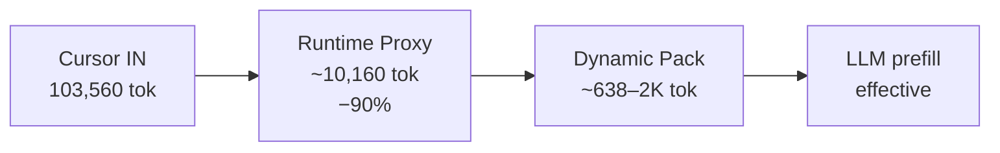
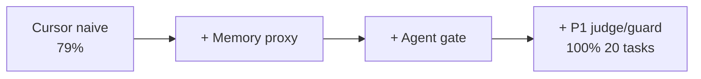
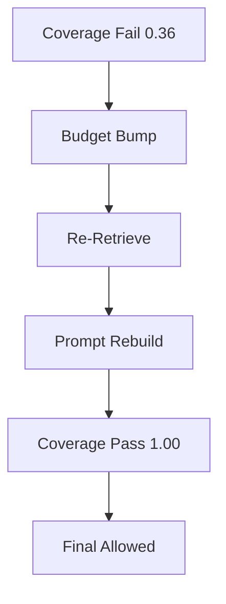
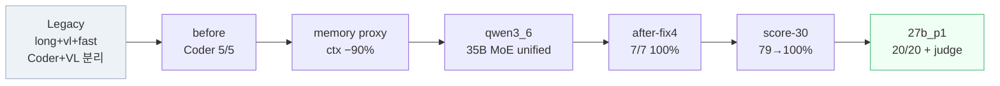

# Benchmark — 변천사 & 상세 수치

> **제품 · Flow 요약** → [VISION.md](./VISION.md)  
> **아키텍처 · Pipeline** → [ARCHITECTURE.md](./ARCHITECTURE.md)  
> 원본: `tmp/benchmark-*.json` · WSL2 · RTX 4080 + 3080 Ti · RAM 64GB

*Last updated: 2026-06-18*

---

## 핵심 그래프 (3초 이해)

### Context 압축 Funnel



```text
103K  →  10K  →  ~3K  →  ~0.6–2K effective
(Cursor) (proxy) (budget slots) (measured p1)
```

### Runtime Success Funnel



### Recovery E2E (Context Runtime IP)



검증: `python3 scripts/benchmark-recovery-e2e.py`

### Memory Hierarchy Quality Gate

```bash
python3 scripts/benchmark-memory-hierarchy.py --quality-gate
python3 scripts/benchmark-repeated-read-avoidance.py
```

| Gate | Threshold | Measured |
|------|-----------|----------|
| raw→GPU ratio | ≤ 0.05 | **0.018** max |
| coverage | ≥ 0.8 | **1.00** min |
| task_success | ≥ 95% | **100%** |
| recovery_success | ≥ 95% | **100%** |
| live re-read avoidance | ≥ 0.90 | **1.00** |
| stress re-read avoidance | ≥ 0.80 | **0.80** |

**Claim (investor-ready)**

```text
AI Runtime은 로컬 LLM 주변에 Memory Hierarchy를 두고,
GPU context에는 현재 작업에 필요한 working set만 올린다.

검증:
- 80K raw → 970~1,415 GPU tokens
- raw→GPU ratio max 0.018
- coverage min 1.00
- task success 100%
- recovery success 100%
- repeated read avoidance live 1.00
- stress target 0.80+
```

Diagram: [`assets/context-runtime-1page.mmd`](./assets/context-runtime-1page.mmd)

| Case | Proves |
|------|--------|
| bugfix | `context_budget.py::allocate_dynamic` must_include + symbol |
| explore | artifact coverage + latest tool result |
| recall | session memory hit (`previous decision`) |
| doc_analysis | retrieved document section |
| recovery | coverage fail → budget bump → re-retrieve → pass |

**2026-06-18 gate (PASS)**

| label | raw | gpu | ratio | coverage | task |
|-------|-----|-----|-------|----------|------|
| bugfix | 80K | 1,093 | 0.014 | 1.00 | OK |
| explore | 80K | 1,270 | 0.016 | 1.00 | OK |
| recall | 80K | 1,058 | 0.013 | 1.00 | OK |
| doc_analysis | 80K | 970 | 0.012 | 1.00 | OK |
| recovery | 80K | 1,415 | 0.018 | 1.00 | OK (1 round) |

```text
80K raw  →  ~1.0–1.4K GPU working set  (not blind 700-token chop)
coverage ≥ 0.8  +  must_include/symbol retained
```

산출: `tmp/benchmark-memory-hierarchy-quality.json` · fail 시 `coverage_fail_reasons[]` per missing item.

### Memory Backend Swap (LangGraph checkpointer / store)

```bash
MEMORY_BACKEND=legacy   python3 scripts/benchmark-memory-hierarchy.py --quality-gate
MEMORY_BACKEND=langgraph python3 scripts/benchmark-memory-hierarchy.py --quality-gate
python3 scripts/benchmark-memory-backend-swap.py
```

| Backend | ratio | coverage | task | recovery | live reread | stress reread | latency_ms | stored | hit_rate |
|---------|-------|----------|------|----------|---------------|---------------|------------|--------|----------|
| legacy | 0.018 | 1.00 | 1.00 | 1.00 | 1.00 | 0.80 | ~0 | 1.8 | 1.0 |
| langgraph | 0.018 | 1.00 | 1.00 | 1.00 | 1.00 | 0.80 | ~224 | 1.8 | 1.0 |

- **API**: `adapters.memory` unchanged — `MEMORY_BACKEND=legacy|langgraph`
- **LangGraph**: `integrations/langgraph_memory.py` only (SqliteStore + SqliteSaver)
- **runtime_core**: LangGraph import 없음 · boundary 0

산출: `tmp/benchmark-memory-backend-swap.json`

### Dynamic Budget Regression

```bash
python3 scripts/benchmark-dynamic-budget-matrix.py   # 25/25
bash scripts/run-vector-e2e.sh                       # 115 artifacts BM25+LlamaIndex
```

---

## 변천사 한눈에



---

## 인프라 변천

| Era | Router 모드 | llama-long | llama-fast | llama-vl | VL pass | 비고 |
|-----|:-----------:|------------|------------|----------|:-------:|------|
| **Legacy** | `legacy` | Coder 30B | (optional) | VL 30B **별도** | ON | VRAM 2~3배, vision→vl 라우팅 |
| **Unified 35B** | `unified` | Qwen3.6-35B + mmproj | OFF | OFF (same weights) | OFF | 단일 서버, VL 통합 |
| **Unified 27B** ★ | `unified` | Qwen3.6-27B + mmproj | OFF | OFF | OFF | **운영 권장**, VRAM KV 여유 |

```text
Legacy:  Cursor → Router → long (Coder) + vl (VL 전용) + fast
Unified: Cursor → Router → long ONLY (코드+비전 동일 weights)
```

---

## 모델 카탈로그 (프로필별)

`configs/model-profiles.env` 기준. 파일명이 **정확한 모델 식별자**다.

| Profile | 정확한 모델명 | 양자화 | 파라미터 | GGUF 파일 | mmproj | ctx 운영 | KV | tensor split |
|---------|--------------|--------|:--------:|-----------|--------|:--------:|:--:|:------------:|
| **`qwen3_coder`** (Legacy) | `Qwen3-Coder-30B-A3B-Instruct` | **UD-Q4_K_XL** | 30B MoE | `Qwen3-Coder-30B-A3B-Instruct-UD-Q4_K_XL.gguf` | — | **200K** | DRAM offload | — |
| **`qwen3_coder`** VL 서버 | `Qwen3-VL-30B-A3B-Instruct` | **Q4_K_M** | 30B MoE | `Qwen3VL-30B-A3B-Instruct-Q4_K_M.gguf` | `mmproj-Qwen3VL-30B-A3B-Instruct-F16.gguf` | 4K~32K | VRAM/DRAM | — |
| **`qwen3_6`** (실험) | `Qwen3.6-35B-A3B` | **UD-Q4_K_M** | 35B MoE | `Qwen3.6-35B-A3B-UD-Q4_K_M.gguf` | `mmproj-F16.gguf` | 32K | VRAM 부족* | — |
| **`qwen3_6_27b`** ★ (운영) | `Qwen3.6-27B` | **UD-Q4_K_XL** | 27B dense | `Qwen3.6-27B-UD-Q4_K_XL.gguf` | `mmproj-F16.gguf` | **32K** | **VRAM** | **43,57** |

\* 35B MoE weights ~**28GB** → 32K VRAM KV 슬롯 거의 없음. 벤치·비교용.  
★ 27B dense weights ~**17.6GB** → 32K VRAM KV ~**9GB 여유**.

**Fallback**: `qwen3_6_27b` → `qwen3_coder` (장애 시)

---

## 종합 비교표 (Era × 수치)

| Era | 벤치 라벨 | 모델 (양자화) | Router 변경 | Agent | Runtime score | ctx proxy | gen tok/s† | prompt tok/s‡ | wall/case |
|-----|-----------|---------------|-------------|:-----:|:-------------:|:---------:|:----------:|:-------------:|:---------:|
| Cursor naive | — | (full history) | 없음 | — | 79% | 103,560 | — | — | 13.9s |
| Legacy VL분리 | `coder-vs-vl` | Coder UD-Q4_K_XL | legacy 3-srv | 3/5 tool | — | 200K long | **51.3** | ~600–1600 | 0.6–1.7s |
| Legacy baseline | `before` | Coder UD-Q4_K_XL | proxy only | **5/5** | — | ~734 | **32.7** | 780 / 17.5 | 1.5s |
| +memory proxy | — | 동일 | state+delta | — | — | **−90%** | — | — | — |
| Unified 35B | `after-qwen36` | 35B UD-Q4_K_M | unified long | 5/6 | — | ~645 | 17.2 | 987 / 21.5 | 9.9s |
| +vision case | `after-qwen36-vision` | 35B + mmproj | unified | 5/7 | — | ~650 | 19.1 | 1034 / 21.5 | 7.7s |
| +router fix | `after-fix4` | 35B + mmproj | evidence gate | **7/7** | — | ~578 | 15.7 | 968 / 22.1 | 2.3s |
| Runtime suite | `score-30` | 35B | plan_state | — | **100%** 30/30 | 10,160 | — | — | 2.8s |
| 27B migrate | `qwen3_6_27b` | 27B UD-Q4_K_XL | 27B profile | 6/7 | 85% 17/20 | ~663 | **28.6** | 1100 / **35.2** | 4.0s |
| **P1 현재** | `qwen3_6_27b_p1` | 27B + judge | planner+guard | **6/6** | **100%** 20/20 | ~638 | **24.6** | 1175 / 34.8 | 2.8s |

† `avg_gen_tps` (agent benchmark wall 기준)  
‡ llama-server `avg_prompt_tps` / `avg_gen_tps` (내부 타이밍)

---

## 토큰 속도 변천

### Legacy — VL 서버 기준선 (`benchmark-coder-vs-vl.json`)

별도 `llama-vl` 컨테이너, `Qwen3VL-30B-A3B-Instruct-Q4_K_M`.

| 조건 | gen tok/s | 비고 |
|------|:---------:|------|
| ctx 4K, VRAM KV | **168.0** | 최고 속도 (짧은 ctx) |
| ctx 24K, max_tokens 1000 | **176.2** | |
| DRAM 200K, tiny | 67.2 | KV offload |
| DRAM 200K, small | 54.4 | |
| DRAM 200K, medium | 47.3 | |
| **VRAM KV 32K** | **27.1** | 27B 운영과 유사 조건 |

### Legacy — Coder long (`benchmark-coder-vs-vl.json`)

`Qwen3-Coder-30B-A3B-Instruct-UD-Q4_K_XL`, ctx 200K.

| 케이스 | gen tok/s | prompt tok/s |
|--------|:---------:|:------------:|
| tiny mt64 | 51.5 | 655 |
| small mt256 | 48.6 | 1154 |
| medium mt512 | 52.7 | 606 |
| large mt1000 | 52.6 | 1135 |
| **평균** | **51.3** | ~800 |

VL 대비: Coder long은 gen **~51 tok/s** vs VL 32K KV **~27 tok/s** — Coder가 decode 빠름.  
단, tool pass **3/5** (Read/Grep 실패多).

### Unified 35B MoE — Router 개선에 따른 속도

| 라벨 | gen tok/s (wall) | llama gen tok/s | wall/case | 비고 |
|------|:----------------:|:---------------:|:---------:|------|
| after-qwen36 | 17.2 | 21.5 | 9.9s | 전환 직후 느림 |
| after-fix2 | 9.1 | 22.5 | 1.8s | wall↓ (프로토콜 수습) |
| **after-fix4** | 15.7 | 22.1 | 2.3s | **7/7 정점** |

### Unified 27B dense — 현재 운영

| 라벨 | gen tok/s (wall) | llama gen tok/s | prompt tok/s | wall/case | agent |
|------|:----------------:|:---------------:|:------------:|:---------:|:-----:|
| qwen3_6_27b | **28.6** | **35.2** | 1100 | 4.0s | 6/7 |
| **qwen3_6_27b_p1** | **24.6** | **34.8** | 1175 | 2.8s | **6/6** |

27B가 35B MoE llama gen (**~22 tok/s**) 대비 **+60% decode** 빠름.  
48턴 ping-pong 케이스 마지막 turn: ~**28 tok/s** (4565 chars).

### Thinking latency (`benchmark-thinking-qwen3627b.log`, 27B)

| Phase | preserve_thinking | wall time |
|-------|:-----------------:|:---------:|
| tool_planning | ON | **2.8s** |
| tool_planning | OFF | 10.1s |
| tool_planning | thinking OFF | 11.3s |
| final_answer | OFF | 17.3s |

→ tool loop에서 `preserve_thinking=ON`이 **3~4× 빠름**.

---

## Agent Benchmark 전체 (`benchmark-cursor-agent.json`)

| 라벨 | 프로필 | 모델 | 통과 | tool_match | json | vision | leaks | ctx avg | gen t/s | wall |
|------|--------|------|:----:|:----------:|:----:|:------:|:-----:|:-------:|:-------:|:----:|
| before | qwen3_coder | Coder-30B **Q4_K_XL** | 5/5 | 100% | — | — | 0 | 734 | 32.7 | 1460 |
| after-qwen36 | qwen3_6 | 35B **Q4_K_M** | 5/6 | 100% | 100% | — | 0 | 645 | 17.2 | 9890 |
| after-qwen36-vision | qwen3_6 | 35B + mmproj | 5/7 | 100% | 100% | 0% | 1 | 650 | 19.1 | 7672 |
| after-fix | qwen3_6 | 35B + mmproj | 4/7 | 100% | 100% | 0% | 0 | 652 | 15.5 | 4098 |
| after-fix2 | qwen3_6 | 35B + mmproj | 4/7 | 100% | 100% | 0% | 0 | 743 | 9.1 | 1826 |
| after-fix3 | qwen3_6 | 35B + mmproj | 6/7 | 100% | 100% | 100% | 0 | 605 | 14.3 | 2238 |
| **after-fix4** | qwen3_6 | 35B + mmproj | **7/7** | 100% | 100% | 100% | 0 | 578 | 15.7 | 2306 |
| qwen3_6_27b | qwen3_6_27b | 27B **Q4_K_XL** | 6/7 | 100% | 100% | 100% | 1 | 663 | 28.6 | 3976 |
| **qwen3_6_27b_p1** | qwen3_6_27b | 27B + mmproj | **6/6** | 100% | 100% | — | 0 | 692 | 24.6 | 2789 |

---

## Runtime Score 변천 (`benchmark-runtime-score.json`)

| 라벨 | tasks | profile | success naive→rt | tools 3.x→ | time ms | passed |
|------|:-----:|---------|:----------------:|:----------:|:-------:|:------:|
| score-30 | 30 | qwen3_6 | 79% → **100%** | 3.03 → **0.60** | 13913 → **2752** | 30/30 |
| score-100 | 100 | qwen3_6 | 79% → **99%** | 3.10 → **0.61** | 12383 → **2437** | 99/100 |
| qwen3_6_27b | 20 | 27B | 79% → 85% | 3.10 → 0.75 | 20120 → 4868 | 17/20 |
| **qwen3_6_27b_p1** | 20 | 27B+P1 | 79% → **100%** | 3.10 → **0.60** | 20326 → **3934** | **20/20** |

공통: Cursor naive ctx **103,560** → Runtime proxy **~10,160** (**−90.2%**)

---

## Context 압축 (`benchmark-runtime.json`)

| 케이스 | Cursor tokens | LLM prompt | 압축률 |
|--------|:-------------:|:----------:|:------:|
| 실제 세션 `1781741948_0001` (289 msgs) | 103,560 | state+delta | **90.2%** |
| 10턴 synthetic | 1,627 | 485 | 66.7% |
| 50턴 synthetic | 7,707 | 488 | **93.0%** |
| agent proxy | 2,844 | 991 | 72.5% |

---

## 마일스톤 × 무엇이 바뀌었나

| # | 시점 | 인프라 / 모델 | Router 기능 | 벤치 임팩트 |
|---|------|---------------|-------------|-------------|
| 0 | 초기 | long+**vl**+fast, Coder+VL | 단순 proxy | VL 168 tok/s, Coder 51 tok/s |
| 1 | before | Coder UD-Q4_K_XL | agent 정규화 | **5/5** tool_match 100% |
| 2 | +memory | 동일 | state+delta proxy | ctx **−90%** |
| 3 | after-qwen36 | **35B** UD-Q4_K_M unified | native tool parser | 5/6, json 100% |
| 4 | after-fix* | 35B + mmproj | plan_state, evidence gate, analyzer | **7/7** |
| 5 | score-30 | 35B | runtime score suite | success **100%** |
| 6 | 27B | **27B** UD-Q4_K_XL | VRAM KV, tensor 43/57 | gen **35 tok/s**, weights −10GB |
| 7 | **p1** | 27B + P1 | judge, loop guard, inspector | **20/20**, agent 6/6 |

---

## 통과 게이트 (현재 `qwen3_6_27b_p1`)

| 게이트 | 목표 | 달성 |
|--------|------|:----:|
| Runtime score 20 tasks | ≥ 95% | **100%** |
| Agent 6-case | 100% | **100%** |
| tool_match | 100% | ✅ |
| json_valid | ≥ 90% | **100%** |
| xml/final leaks | 0 | ✅ |
| vision (7-case) | 100% | ▶ flaky 1 run |
| Context 압축 | ≥ 80% | **90.2%** |

---

## 재현

```bash
# 프로필 전환
./scripts/switch-model.sh qwen3_6_27b   # 운영
./scripts/switch-model.sh qwen3_coder # legacy 비교

# 벤치
python3 scripts/benchmark-cursor-agent.py --label qwen3_6_27b_p1
python3 scripts/benchmark-runtime-score.py --tasks 30
python3 scripts/benchmark-runtime.py
python3 scripts/benchmark-thinking-runtime.py
```

| 파일 | 내용 |
|------|------|
| `tmp/benchmark-cursor-agent.json` | Agent 변천 (10 runs 누적) |
| `tmp/benchmark-runtime-score.json` | Runtime score 변천 |
| `tmp/benchmark-runtime.json` | Context 압축 |
| `tmp/benchmark-coder-vs-vl.json` | Legacy Coder vs VL 속도 |
| `tmp/benchmark-*-qwen3627b.log` | 27B 실행 로그 |
