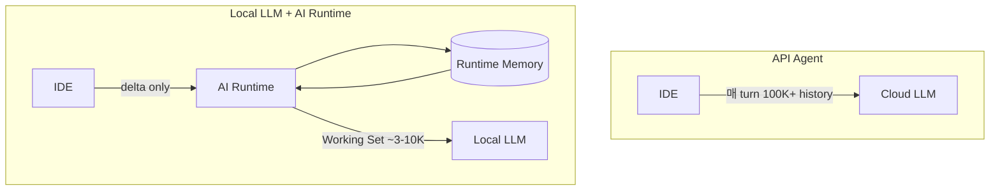

# AI Runtime — Local LLM Runtime Layer

> **AI Runtime은 API Agent를 위한 Context 압축기가 아니다.**  
> **로컬 LLM이 장시간 프로젝트를 수행할 수 있도록 Project Memory, Working Set, GPU Context를 관리하는 실행 계층(Runtime Layer)이다.**  
> **LLM은 Thinking을 담당하고, Runtime은 Memory와 Context를 담당한다.**

| | |
|---|---|
| **제품** | **AI Runtime** — Local LLM Memory & Context Scheduler |
| **v1 SKU** | Memory Scheduler + Working Set + Project Index (Cursor 참조 구현) |
| **구현** | `cursor-local-llm` — Cursor + llama.cpp middleware |
| **하지 않는 것** | Prompt Engineering 회사 · IDE · Cursor 경쟁 · “KV에 다 넣어두기” |

---

## 문서 구조

| 문서 | 독자 | 내용 |
|------|------|------|
| **[VISION.md](./VISION.md)** | 투자자 · PM | 철학 · Problem · Product · Roadmap |
| **[ARCHITECTURE.md](./ARCHITECTURE.md)** | 개발 · 심사 | Pipeline · Module · Sequence · Audit |
| **[REFACTOR.md](./REFACTOR.md)** | 엔지니어링 | 3-tier 리셋 · Phase 계획 |
| **[BENCHMARK.md](./BENCHMARK.md)** | 검증 | 수치 · 재현 |

---

## 목차

1. [설계 철학](#1-설계-철학)
2. [Problem — API vs Local](#2-problem--api-vs-local)
3. [Runtime Memory vs GPU Context](#3-runtime-memory-vs-gpu-context)
4. [Runtime 구성요소](#4-runtime-구성요소)
5. [Master Flow](#5-master-flow)
6. [Build vs Buy](#6-build-vs-buy)
7. [제품 · Roadmap](#7-제품--roadmap)
8. [Benchmark Snapshot](#8-benchmark-snapshot)

---

## 1. 설계 철학

### 1.1 한 줄

Runtime은 LLM 대신 **생각하지 않는다**. LLM이 **생각하기 좋은 환경**을 만든다.

```text
Runtime Memory (cold)     →  Project Index · Session · Artifact · Journal · Evidence
Working Set Planner       →  이번 turn에 GPU에 올릴 최소 집합 선별
Prompt Pack               →  Working Set의 LLM-facing 표현
GPU Context / KV prefix   →  작업 메모리 (cache) — 장기 memory 아님
Local LLM                 →  Thinking · Tool 선택 · Final prose
```

### 1.2 GPU Context ≠ Memory

| | GPU Context / KV | Runtime Memory |
|--|------------------|----------------|
| 역할 | CPU L1 cache | RAM / DB / artifact store |
| 수명 | 현재 prefix · turn | 프로젝트 · 세션 · journal |
| 내용 | Working Set만 | Index · delta · tool · evidence |
| LLM이 “기억” | ❌ (재계산 캐시) | ✅ (Runtime이 조회) |

**로컬 LLM도 자동으로 장기 기억하지 않는다.** KV는 prefix 계산 캐시일 뿐, semantic project memory가 아니다.

### 1.3 Prompt 회사가 아니다

```text
우리는 Prompt를 잘 만드는 회사가 아니다.

LLM이 무엇을 보고 · 읽고 · 기억하고 · 버릴지를 관리하는 Runtime을 만든다.
```

Context **압축률**은 부수 지표이고, **목표는 장시간 로컬 작업 연속성**이다.

### 1.4 Runtime = 경량 OS (비유)

```text
AI Runtime
 ├── Project Index Manager      (구조 map · invalidation)
 ├── Memory Manager             (session · artifact · journal)
 ├── Working Set Manager        (hot path — GPU에 올릴 것)
 ├── Context Scheduler          (budget · retrieve · summarize)
 ├── Evidence Manager           (anchor + summary)
 ├── Task Journal / Handoff     (작업 연속성)
 ├── Tool Coordinator           (결과 저장 — thinking은 LLM)
 └── GPU Context Manager        (KV prefix = 보조 최적화)
```

---

## 2. Problem — API vs Local

### API Agent (Stateless)

매 요청: System + Tools + Full History + Project State + Prior Results **재전송**  
→ 비용 · 지연 · blind truncate

### Local LLM (Runtime co-located)

Runtime이 옆에서 **Project Memory** 유지 → LLM은 **Working Set**만 수신  
→ Thinking은 LLM, Memory는 Runtime



---

## 3. Runtime Memory vs GPU Context

### 3.1 Memory tiers

| Tier | 저장 | GPU |
|------|------|:---:|
| **Project Index** | dir tree · entrypoints · file hash · git commit | ❌ |
| **Session Memory** | delta · dialogue tail · task state | tail만 |
| **Artifact Memory** | tool/file raw + excerpt | 필요분 |
| **Evidence Memory** | path · symbol · line · hash · summary | anchor |
| **Task Journal** | read/edit/tool/failure/success | ❌ |
| **Handoff Ledger** | 진행률 · touched files · remaining | pointer |
| **Vector Index** | optional retrieval (Buy) | hit만 |
| **Working Set** | — | **✅ 전부** |

### 3.2 Project Index Bootstrap

프로젝트 최초(또는 stale) 1회 — **LLM 없이** pipeline scan:

```text
directory tree · file hash · mtime · git commit · entrypoints · symbol hints
        ↓
project_fingerprint + index_version  →  invalidation
```

`runtime_kernel/project_index.py` · env `PROJECT_INDEX_BOOTSTRAP=1`

### 3.3 Evidence Anchor (요약만 저장 금지)

```text
path · symbol · line_start-end · content_hash · summary · why_read · quality
```

`runtime_kernel/evidence_anchor.py`

### 3.4 Task Journal & Handoff

```text
Journal: read / edit / tool / failure / success / turn
Handoff: touched files · evidence · remaining risks · journal tail
Final report: Journal 기반 render → LLM은 polish만 (optional)
```

`runtime_kernel/task_journal.py`

---

## 4. Runtime 구성요소

### 4.1 코드 3계층 (2026-06 리셋)

```text
runtime_kernel/     Memory Scheduler — index · working set · journal · budget · coverage
agent_brain/          AI Planner — RuntimeState → next action (Phase 2)
observability/        Trace SSOT — turn_log primary
reference/            Cursor agent POC — hard guard + tool exec (v2 경계 명시)
```

### 4.2 Thinking vs Runtime

```text
LLM:  need more info? → Read / Grep / Glob / Shell (스스로 결정)
Runtime: tool 결과 → artifact · evidence anchor · journal 저장
Runtime: hard guard만 — ping-pong · leak · premature final
```

Tool은 LLM 사고의 **연장**이며, Runtime은 그 **기록·재사용**을 담당한다.

---

## 5. Master Flow

### 5.1 Target (Memory Scheduler)

```text
Cursor IN (full history — Router만 수신)
    ↓
Memory Ingest (delta · artifact · session)
    ↓
Project Index ensure (bootstrap if stale)
    ↓
Need Analysis (intent SSOT)
    ↓
Working Set Plan  ← hot path (P0)
    ↓
Retrieve (single pass, WS budget)
    ↓
Dynamic Budget + Pre-pack constraints
    ↓
Prompt Pack
    ↓
Coverage (+ Recovery)
    ↓
Local LLM (Thinking)
    ↓
Tool results → Memory · Journal
```

### 5.2 이전 vs 현재

| | 이전 (압축 프록시) | 현재 (목표) |
|--|-------------------|-------------|
| Working Set | 메트릭만 | **retrieve 전** hot path |
| Retrieve | 2-pass | **1-pass** (WS budget) |
| Coverage | prompt **후** 감사 only | pre-pack constraint + post audit |
| Project map | 없음 | **Index bootstrap** |
| Final | LLM 재추론 | **Journal render** |

구현: `dynamic_context_scheduler.build_context_for_turn`

---

## 6. Build vs Buy

| Build (IP) | Buy (Adapter) |
|------------|---------------|
| Memory Scheduler · Working Set · Project Index | llama.cpp / vLLM |
| Task Journal · Evidence Anchor · Coverage · Recovery | LlamaIndex (optional) |
| RuntimeState · Self Model | LiteLLM gateway (optional) |
| | LangGraph checkpoint (optional) |
| | OTel / Langfuse export |

**직접 재개발 금지**: vector engine · inference · dashboard UI  
**Build**: Memory가 무엇을 GPU에 올릴지 **결정하는 정책**

---

## 7. 제품 · Roadmap

### 7.1 SKU

| 버전 | SKU | 핵심 |
|:----:|-----|------|
| **v1** | **Memory Runtime** | Project Index · Working Set · Journal · Handoff |
| v2 | Agent Brain | RuntimeState → AI Planner decision |
| v3 | GPU Runtime | KV prefix policy · multi-GPU |
| v4 | Enterprise | on-prem · policy console |

### 7.2 GTM

| 단계 | 산출물 |
|------|--------|
| **지금** | Cursor reference + OpenAI-compatible `:8080` |
| Next | CLI daemon · VSCode/JetBrains plugin |
| Later | Runtime SDK · hosted policy |

### 7.3 엔지니어링 우선순위

| P | 항목 | 상태 |
|:-:|------|:----:|
| P0 | Project Index Bootstrap | ✅ |
| P0 | Working Set hot path | ✅ |
| P0 | Task Journal / Handoff | ✅ |
| P0 | Intent / Phase SSOT | ✅ |
| P1 | AI Planner = decision authority | ⬜ Phase 2 |
| P1 | Memory summarization loop | ⬜ Phase 3 |
| P1 | reference/ v2 hot path 분리 | ⬜ |
| P2 | Final Report Renderer (journal-first) | ⬜ |

---

## 8. Benchmark Snapshot

Context **압축**은 부수 효과:

| 지표 | Before | After (p1) |
|------|:------:|:------------:|
| Cursor proxy | 103K | ~10K (−90%) |
| Memory hierarchy ratio | — | ≤0.018 (gate) |
| Recovery E2E | — | pass |

전체 → [BENCHMARK.md](./BENCHMARK.md)

```bash
python3 scripts/benchmark-memory-hierarchy.py --quality-gate
python3 scripts/benchmark-recovery-e2e.py
```

---

## 관련 문서

| 문서 | 역할 |
|------|------|
| [ARCHITECTURE.md](./ARCHITECTURE.md) | 기술 Flow · Audit §12 |
| [REFACTOR.md](./REFACTOR.md) | 3-tier 리셋 계획 |
| [MODULE_MAP.md](./MODULE_MAP.md) | 코드 tier |

*Last updated: 2026-06-22 — Local LLM Runtime philosophy · Memory Scheduler · Working Set hot path*
