# AI Runtime — Context Runtime for Every IDE

> **AI Runtime은 로컬 LLM 주변에 Memory Hierarchy를 구성하고, GPU context에는 현재 작업에 필요한 working set만 올리는 실행 계층이다.**
>
> API LLM은 매 요청이 stateless라 full history를 반복 전송한다. 로컬 LLM은 Runtime Memory(RAM/DB/artifact/vector)에 맥락을 저장하고, **GPU Context = 작업 메모리(L1)** 에 필요한 것만 올린다.

| | |
|---|---|
| **제품** | **Context Runtime** (v1) — Universal AI Runtime의 첫 SKU |
| **구현** | Cursor + Local LLM **Runtime Middleware** (참조 구현) |
| **하지 않는 것** | IDE · Cursor 경쟁 · VSCode Fork · “OS” 브랜딩 |

---

## 문서 구조 (3분할)

| 문서 | 독자 | 내용 |
|------|------|------|
| **[VISION.md](./VISION.md)** (이 문서) | 투자자 · PM · 파트너 | Problem · Product · Business · Roadmap + **핵심 Flow 요약** |
| **[ARCHITECTURE.md](./ARCHITECTURE.md)** | 개발자 · 기술 심사 | Pipeline · Need · Budget · Recovery · Closed Loop · Module Map · Sequence |
| **[BENCHMARK.md](./BENCHMARK.md)** | 검증 · 구매 담당 | 수치 · 그래프 · 재현 명령 |
| **[dependency-before-after.md](./dependency-before-after.md)** | 구조 심사 · 리팩토링 증명 | Before/After import graph · Memory Hierarchy path |

기술 심화: [MODULE_MAP.md](./MODULE_MAP.md) · [INTEGRATIONS.md](./INTEGRATIONS.md)

---

## 목차

1. [Problem — 왜 필요한가](#1-problem--왜-필요한가)
2. [Market Pain](#2-market-pain)
3. [Why Existing Solutions Fail](#3-why-existing-solutions-fail)
4. [Our Runtime — 한 장 요약](#4-our-runtime--한-장-요약)
5. [제품 정의](#5-제품-정의)
6. [Architecture Snapshot](#6-architecture-snapshot)
7. [Benchmark Snapshot](#7-benchmark-snapshot)
8. [Business](#8-business)
9. [Roadmap](#9-roadmap)

---

## 1. Problem — 왜 필요한가

LLM 능력은 빠르게 성장했지만, **실행 스택은 거의 진화하지 못했다.**

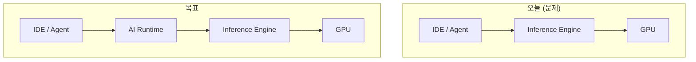

Application이 Engine에 직접 붙으면:

- 컨텍스트 무한 성장 → **API 비용 · OOM · 지연**
- blind truncate → **근거 없는 답**
- Agent 반복 Read → **루프 · ping-pong**

**cursor-local-llm**은 Cursor 위에서 Context Runtime MVP를 검증하는 **첫 참조 구현**이다.

### 1.1 LLM Memory Hierarchy (제품 핵심)

API LLM은 stateless — 매 요청 full history. **로컬 LLM은 Runtime이 옆에 있으므로 메모리 계층을 둔다.**

```text
GPU Context     = 작업 메모리 / L1 cache   ← 현재 turn working set만
Runtime Memory  = RAM / DB / artifact store / session state
Vector Memory   = 장기 검색 인덱스
Prompt Pack     = LLM에 올릴 working set (선택 결과)
```

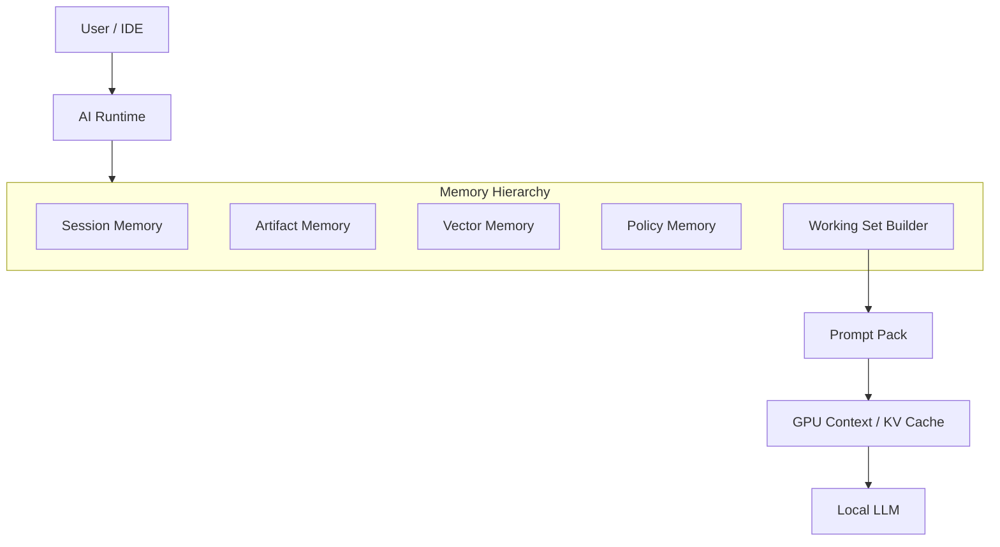

| 계층 | 저장 | GPU에 올리는가 |
|------|------|----------------|
| Session | 최근 대화 · task state | tail만 |
| Artifact | file · tool result | 필요분만 |
| Vector | retrieval index | 검색 hit만 |
| Policy | failed action · ban | 요약만 |
| **Working Set** | — | **최종 선별 결과** |

벤치: `python3 scripts/benchmark-memory-hierarchy.py --quality-gate` · `python3 scripts/benchmark-repeated-read-avoidance.py` · Inspector **Memory Hierarchy** funnel · Langfuse `memory.hierarchy.snapshot`

**Quality gate (2026-06-18)**: 80K raw → **970~1,415 GPU tokens** (ratio ≤ 0.018), **coverage 1.00**, task/recovery **100%**, repeated-read **live 1.00 · stress 0.80**.

> AI Runtime은 로컬 LLM 주변에 Memory Hierarchy를 두고, GPU context에는 현재 작업에 필요한 working set만 올린다.

---

## 2. Market Pain

### 2.1 Context 비용 (v1 — 1순위)

| 증상 | 원인 |
|------|------|
| API 청구서 폭증 | 매 요청 200K~600K history 재전송 |
| Local LLM OOM | 32K ctx에 100K+ prompt |
| 품질 저하 | truncate 후 “잘렸는지” 모름 |

### 2.2 Agent 실행 (v2)

Read/Grep 반복 · 조기 final · tool loop — `reference/` 모듈로 Cursor POC 검증 중.

### 2.3 GPU (v3 · Enterprise)

VRAM · KV · multi-GPU — Enterprise가 먼저 지불.

---

## 3. Why Existing Solutions Fail

> **같은 계층끼리만 비교한다.** Coverage는 Proxy 기능이 아니다. Delta는 Memory DB가 아니다.

| 계층 | 기존 (Buy) | 우리 (Build — Policy Layer) |
|------|------------|----------------------------|
| **Vector Retrieval** | LlamaIndex, Haystack | **Retrieval Budget Policy** — Need-aware rank · token ceiling |
| **State Persistence** | LangGraph checkpointer, Letta store | **Context-aware Delta Compression** — history→delta→artifact scheduling |
| **Memory Runtime** | LangGraph session graph | **Context-aware Memory Scheduling** — hot/cold · artifact priority |
| **OpenAI Gateway** | LiteLLM, OpenRouter | **Runtime Policy Layer** — Need→Budget→Coverage→Recovery (gateway 위) |
| **Inference Runtime** | vLLM, llama.cpp, Ollama | Adapter only — tensor 연산은 Buy |
| **Tracing / Dashboard** | OpenTelemetry, Langfuse, LangSmith | Metric schema만 Build · export는 Buy |
| **Runtime Scheduler** | *(직접 경쟁 없음)* | **Context Scheduler** — 핵심 IP |

**직접 재개발 금지** — [INTEGRATIONS.md](./INTEGRATIONS.md).  
**Build**: Context Scheduling · Coverage · Recovery · Budget Policy만.  
**Buy**: Gateway · Vector engine · Checkpointer · Trace · Dashboard.

IDE를 만들지 않는다. Runtime은 **플러그인 + 백그라운드 서비스** (Cursor · VSCode · JetBrains · CLI).

### Build vs Buy (요약)

| 영역 | Build | Buy |
|------|:-----:|:---:|
| Vector engine | ❌ | LlamaIndex / Haystack |
| Tracing export | ❌ | OpenTelemetry |
| Prompt/provider cache | ❌ | Provider / vLLM |
| Memory graph / checkpoint | ❌ | LangGraph |
| OpenAI gateway | ❌ | LiteLLM |
| Agent state machine | ❌ | LangGraph (v2) |
| Dashboard UI | ❌ | Langfuse / Phoenix |
| **Runtime Scheduler** | ✅ | — |
| **Coverage Engine** | ✅ | — |
| **Recovery Loop** | ✅ | — |
| **Dynamic Budget Policy** | ✅ | — |
| **Delta Context Policy** | ✅ | — |

---

## 4. Our Runtime — 한 장 요약

> 투자자·PM용 **3분 버전**. 상세 Flow · Sequence → [ARCHITECTURE.md](./ARCHITECTURE.md)

### 4.1 Problem → Answer (마스터 Flow)

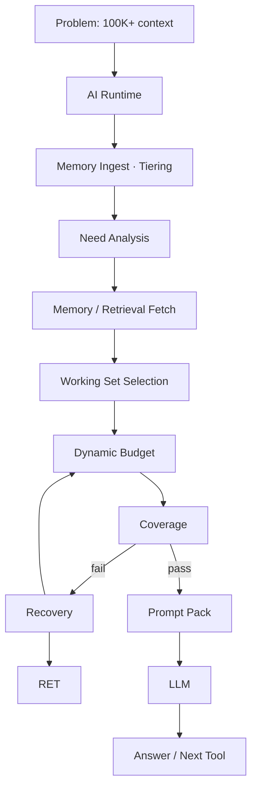

```text
Problem → Runtime → Memory → Need → Retrieve → Budget → Coverage → Recovery? → LLM → Answer
```

### 4.1b Runtime — 왜 각 단계가 있는가

```text
Need        → LLM이 이번 턴에 무엇이 필요한지 결정 (intent · coverage_targets)
Retrieve    → 필요한 문서·코드·tool 결과만 수집 (vector engine = Buy)
Measure     → retrieval 실측 token (추정이 아님)
Allocate    → 32K context window 안에서 slot 재배치 (Dynamic Budget)
Coverage    → truncate·symbol·must_include 검사 — “잘렸는지” 앎
Recovery    → 부족하면 budget↑ · re-retrieve · prompt rebuild
Prompt      → budget-aware pack (단순 template 아님)
LLM         → Inference engine (Buy: llama.cpp · vLLM · API)
```

### 4.2 Runtime 내부 (Core IP + 우선순위)

```text
AI Runtime (Context Runtime v1)
────────────────────────────────
Message Index
    ↓
Memory Store (delta · artifact · session)
    ↓
Need Analysis (ContextNeed)
    ↓
Retriever (+ optional Vector)
    ↓
Dynamic Budget (measure → allocate)
    ↓
Coverage Check
    ↓
Recovery Loop
    ↓
Prompt Builder
    ↓
LLM
    ↓
Inspector / Turn Log          ★★☆☆☆  (metric schema Build · UI Buy)
```

| Core IP | 중요도 | Build/Buy |
|---------|:------:|-----------|
| Dynamic Budget | ★★★★★ | Build |
| Coverage Engine | ★★★★★ | Build |
| Recovery Loop | ★★★★★ | Build |
| Need Analysis | ★★★★★ | Build |
| Delta Context Policy | ★★★★☆ | Build (LangGraph 위 policy) |
| Artifact Priority | ★★★★☆ | Build |
| Message Index | ★★★☆☆ | Build |
| Inspector metrics | ★★☆☆☆ | Build schema · Buy UI |

### 4.2b Context Scheduler — Inputs / Outputs

Scheduler는 “Budget” 라벨만으로는 설명되지 않는다. **입력·출력 계약**이 있다.

```text
Inputs                          Outputs (token budget per slot)
────────────────────────        ────────────────────────────────
Intent                          History      (session_tail + delta)
Phase                           Retrieved
Retrieved Tokens (measured)     Artifact
Coverage Score / Complete       Memory       (state slot)
GPU Backend                     Output Tokens
Context Window (32K)            System · Plan · Current Task
Max Output Tokens
Recovery Round
```

구현: `runtime_core/scheduler_contract.py` · 오케스트레이션: `dynamic_context_scheduler.py`

### 4.3 Dynamic Budget — 핵심 IP (왜 우리인가)

Budget은 설정값이 아니라 **실행 정책**이다.

```text
Question
    ↓
Need Analysis        ← intent · coverage_targets · must_include
    ↓
Retriever            ← artifact + vector, 실측 token
    ↓
Measure              ← retrieval_total_tokens
    ↓
Allocate             ← allocate_dynamic (NOT static ratio)
    ↓
Coverage             ← symbol · truncation · evidence
    ↓
Recovery (if fail)   ← budget+ → re-retrieve → rebuild
    ↓
Prompt → LLM
```

Intent 예: **recall** → session_tail↑ · **bugfix** → retrieved↑ + `file.py::func` coverage

### 4.4 Recovery Loop

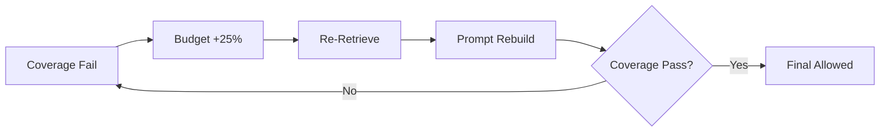

E2E 검증: `scripts/benchmark-recovery-e2e.py` ✅

### 4.5 Memory Layer

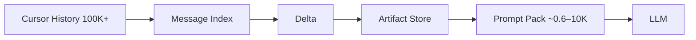

| 계층 | Hot | Cold |
|------|-----|------|
| 메시지 | delta tail | message_keys snapshot |
| 컨텍스트 | incremental index | rebuild on mismatch |
| 실패 tool | cold summary | failed_tool_summaries |

### 4.6 Closed Loop (v1 + v2 reference)

Context Runtime v1은 **Coverage → Recovery**까지. Agent judge는 v2 reference.

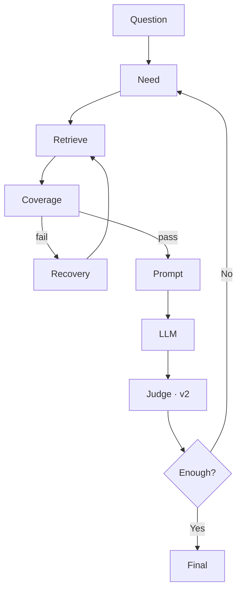

전체 Sequence · 19단계 파이프라인 → [ARCHITECTURE.md §2–§6](./ARCHITECTURE.md)

---

## 5. 제품 정의

> **AI Runtime** = Universal Middleware · **v1 SKU = Context Runtime**

| 버전 | SKU | Pain |
|:----:|-----|------|
| **v1** | **Context Runtime** | Context/API cost, OOM |
| v2 | Agent Runtime | tool loop, evidence |
| v3 | GPU Runtime | VRAM, KV |
| v4 | Enterprise Runtime | on-prem, policy |

```text
백그라운드 Runtime (:8080, OpenAI-compatible)
    ↑
Cursor · Continue · CLI · JetBrains plugin
```

---

## 6. Architecture Snapshot

### 6.0 Reference Architecture (한 장)

> **우리는 IDE도 아니고 모델도 아니다. 그 사이의 Runtime Policy Layer.**

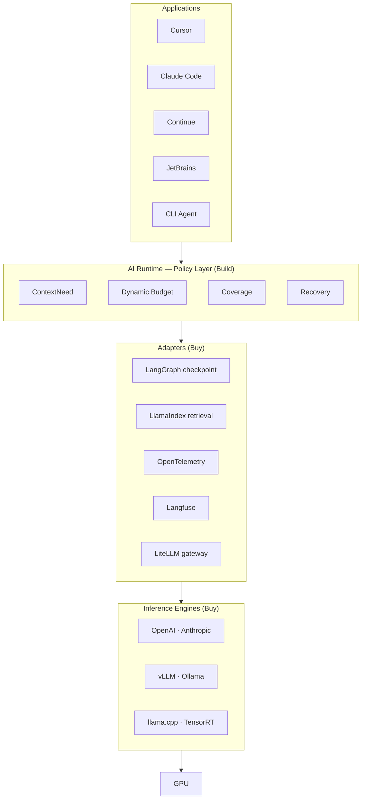

```text
IDE / Agent  →  Runtime Policy  →  Adapters  →  LLM Engine  →  GPU
(Build)          (Build)            (Buy)         (Buy)
```

코드 구조: `runtime_core/` (Build) · `adapters/` (Buy) · `legacy/` (POC shim) · `reference/` (Cursor v2)

### 6.1 네 계층

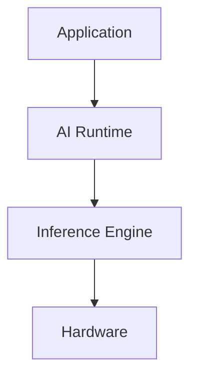

### 6.2 Module Map (간략)

```text
runtime_core/     ContextNeed · Budget · Coverage · Recovery · Scheduler contract  (Build)
adapters/         memory · retrieval · gateway · trace · langgraph · mcp         (Buy glue)
legacy/           POC backend — memory_store · retriever · agent_runs (adapter만 접근)
reference/        v2 Agent POC
integrations/     llamaindex · otel · langfuse
```

**Import 규칙**: app 코드 → `adapters/` · engine/backend → `legacy/` · Core IP → flat + `runtime_core/`

상세 모듈表 → [ARCHITECTURE.md §7](./ARCHITECTURE.md) · [MODULE_MAP.md](./MODULE_MAP.md)

---

## 7. Benchmark Snapshot

### 7.1 Context 압축 Funnel

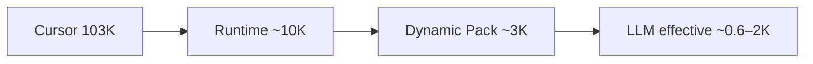

### 7.2 Runtime Success

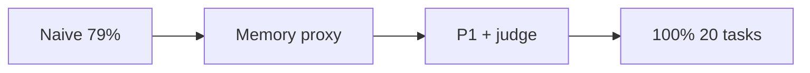

| 지표 | Before | After (p1) |
|------|:------:|:------------:|
| Context | 103K | **~10K (−90%)** |
| Runtime success | 79% | **100%** |
| Tool calls / task | 3.03 | **0.6** |
| Recovery E2E | — | **pass** |

전체 표 · 그래프 · 재현 → [BENCHMARK.md](./BENCHMARK.md)

```bash
python3 scripts/benchmark-dynamic-budget-matrix.py   # 25 cases
python3 scripts/benchmark-recovery-e2e.py
bash scripts/run-vector-e2e.sh                       # 115 artifacts
```

---

## 8. Business

### 8.1 누가 돈을 내는가

| 세그먼트 | SKU |
|----------|-----|
| API 팀 (GPT/Claude) | v1 Context Runtime |
| Local LLM 사용자 | v1 |
| Agent 팀 | v2 |
| Enterprise GPU farm | v3–v4 |

### 8.2 경쟁 (같은 계층)

| | Context Policy | Runtime Scheduler | Coverage/Recovery |
|--|:--------------:|:-----------------:|:-----------------:|
| Cursor (built-in) | △ | ❌ | ❌ |
| LiteLLM (gateway) | ❌ | ❌ | ❌ |
| LlamaIndex (retrieval) | △ rank only | ❌ | △ |
| LangGraph (agent graph) | △ state | ❌ | △ |
| **AI Runtime v1** | ✅ | ✅ | ✅ |

---

## 9. Roadmap

### 9.1 Product SKU

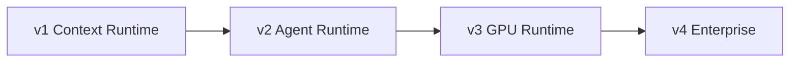

### 9.2 Go-to-Market

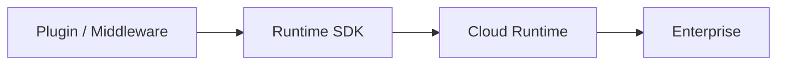

| 단계 | 산출물 |
|------|--------|
| **지금** | Cursor middleware + OpenAI API |
| Plugin | VSCode · JetBrains · CLI daemon |
| SDK | `@cursor/sdk` style runtime client |
| Cloud | hosted context policy |
| Enterprise | on-prem · SSO · policy console |

### 9.3 v1 엔지니어링 상태

| Core IP | 상태 |
|---------|:----:|
| Dynamic Budget + ContextNeed | ✅ |
| Coverage + Recovery E2E | ✅ |
| Vector retrieval E2E (115 artifacts) | ✅ |
| Inspector + OTel flow | ✅ |
| Agent layer (reference/) | ▶ v2 분리 |

---

## 관련 문서

| 문서 | 역할 |
|------|------|
| [ARCHITECTURE.md](./ARCHITECTURE.md) | **기술 심화** — Flow, Closed Loop, Sequence |
| [BENCHMARK.md](./BENCHMARK.md) | **객관 근거** — 변천사, 그래프 |
| [MODULE_MAP.md](./MODULE_MAP.md) | 코드 계층 |
| [INTEGRATIONS.md](./INTEGRATIONS.md) | Build vs Buy |
| [archive/VISION-os-era-2026-06.md](./archive/VISION-os-era-2026-06.md) | OS-era 아카이브 |

---

*Last updated: 2026-06-18 — Build vs Buy layer alignment · Scheduler I/O · Reference Architecture*
