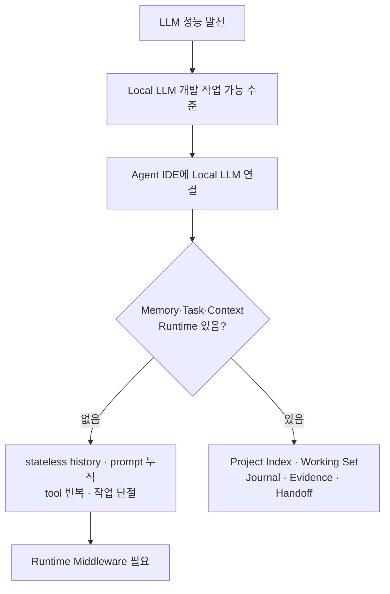
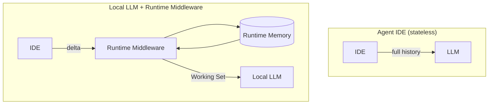
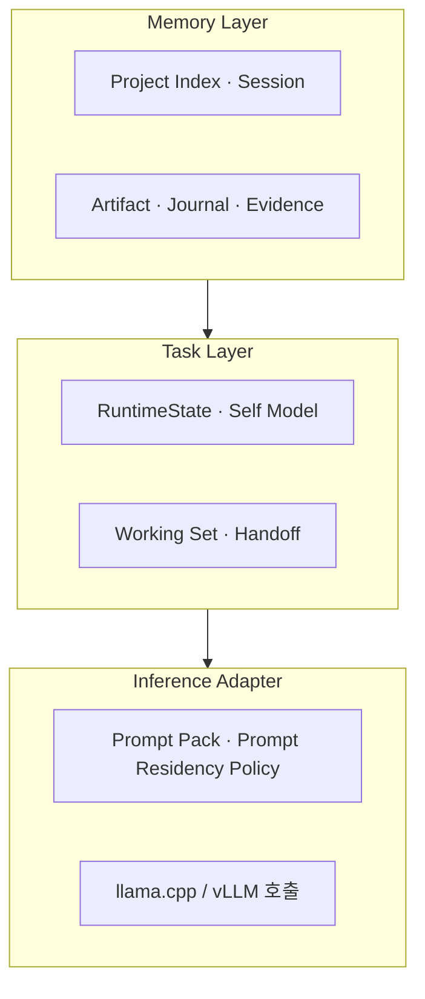
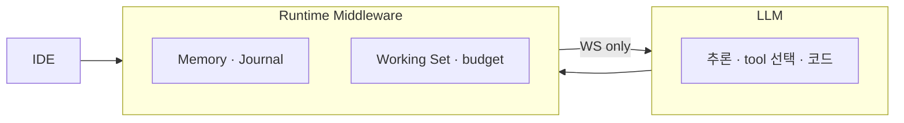
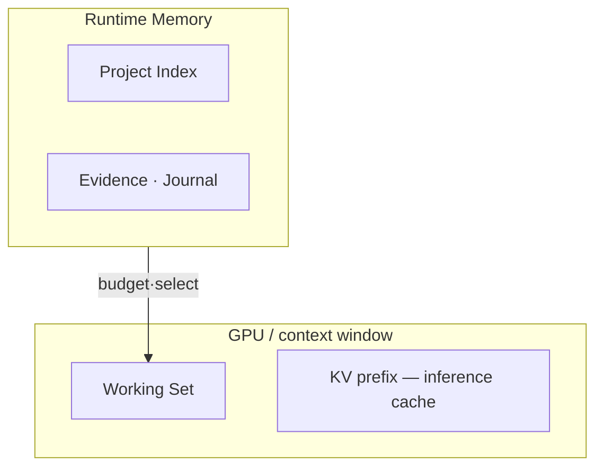
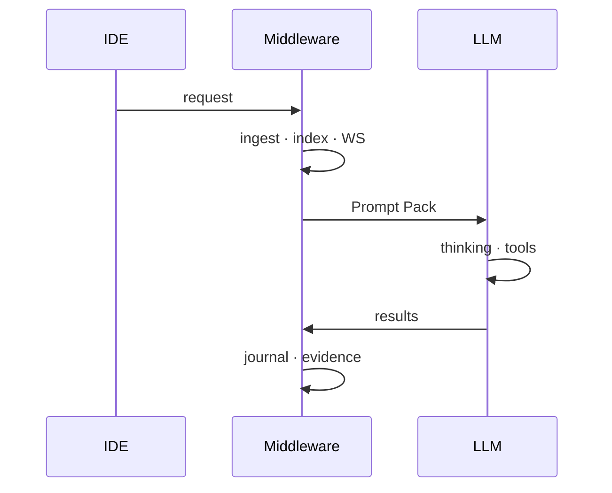

# AI Runtime — Local LLM Agent Runtime Middleware

> LLM 성능은 빠르게 발전했고, Local LLM도 개발 작업에 쓸 수 있는 수준이 되었다. 그러나 Local LLM을 Agent IDE에 그대로 붙이면 **프로젝트 기억 · 작업 상태 · Context 예산 · Tool 결과 재사용** 문제가 남는다. 기존 Agent 구조는 API 시대의 stateless 호출 · history 재전송 · prompt 중심 설계에 가깝다. Local 환경에서는 **Project Index · Working Set · Journal · Evidence · Handoff** 같은 Runtime middleware가 필요하다.
>
> Agent Runtime에 대한 연구와 제품화는 빠르게 진행 중이지만, **Local LLM을 장시간 개발 작업에 안정적으로 쓰기 위한 Memory · Task · Context Runtime은 아직 표준화되지 않았다.** 본 프로젝트는 그 격차를 메우는 **현실적인 Runtime Middleware** 를 제안한다.
>
> **LLM은 Thinking을 담당하고, Runtime middleware는 기억 · 작업 상태 · Context 예산을 담당한다.**

| | |
|---|---|
| **제품** | **AI Runtime** — Local LLM Agent Runtime Middleware |
| **v1 (현재)** | Memory Layer + Working Set + Project Index (`cursor-local-llm` 참조 구현) |
| **구현** | IDE ↔ **Runtime Middleware** ↔ llama.cpp / vLLM |
| **하지 않는 것** | Inference OS · Gateway 대체 · Cursor 분석기 · **Context 압축기** · Prompt Framework |

**상태 범례** (본 문서 전역)

| 표기 | 의미 |
|------|------|
| **Implemented** | `cursor-local-llm`에 동작 중 |
| **In Progress** | 계약·shadow·부분 wire 존재 |
| **Planned** | 설계만 있거나 hot path 미연결 |

> **§3 설계 원칙**은 구현이 바뀌어도 유지하는 방향 SSOT이다. Agent·개발자는 코드 작업 전 §3을 먼저 읽는다.

---

## 문서 구조

| 문서 | 독자 | 내용 |
|------|------|------|
| **[VISION.md](./VISION.md)** | 투자자 · PM · **Agent** | Problem · **설계 원칙** · 구현 현황 · Roadmap |
| **[ARCHITECTURE.md](./ARCHITECTURE.md)** | 개발 · 심사 | Pipeline · Module · Sequence · Audit |
| **[REFACTOR.md](./REFACTOR.md)** | 엔지니어링 | Phase · 구현 상태 |
| **[BENCHMARK.md](./BENCHMARK.md)** | 검증 | 수치 · 재현 |

---

## 목차

1. [Problem — Local LLM과 Agent IDE 사이의 Runtime 격차](#1-problem--local-llm과-agent-ide-사이의-runtime-격차)
2. [Product — Runtime Middleware](#2-product--runtime-middleware)
3. [설계 원칙 (Design Principles)](#3-설계-원칙-design-principles)
4. [Runtime Memory vs GPU Context](#4-runtime-memory-vs-gpu-context)
5. [Master Flow](#5-master-flow)
6. [Build vs Buy](#6-build-vs-buy)
7. [부록 — 기존 기술의 한계](#7-부록--기존-기술의-한계)
8. [제품 · Roadmap](#8-제품--roadmap)
9. [Benchmark Snapshot](#9-benchmark-snapshot)

---

## 1. Problem — Local LLM과 Agent IDE 사이의 Runtime 격차

### 1.1 문제 정의



1. **LLM 성능은 빠르게 발전했다.** Cloud·Local 모두 추론 품질이 실용 수준에 도달했다.
2. **Local LLM도 개발 작업에 쓸 수 있는 수준**으로 올라오고 있다. (Qwen · DeepSeek · Llama 등, 단일 워크스테이션)
3. **Local LLM을 Agent IDE에 붙이면 Runtime 문제가 남는다.** 모델만으로는 장시간 작업을 지속하지 못한다.
4. **기존 Agent 구조**는 API 시대의 stateless 호출 · history 재전송 · prompt 중심 설계에 가깝다.
5. **Local 환경**에서는 Project Index · Working Set · Journal · Evidence · Handoff 같은 **Runtime middleware 계층**이 필요하다.

본질적 문제는 “API vs Local”이 아니라 **장시간 개발 작업의 상태를 누가 유지하느냐** 이다.

| 증상 | 원인 |
|------|------|
| 이미 읽은 파일을 반복 탐색 | Evidence · Journal 부재 |
| Tool 결과가 history에만 쌓임 | Artifact tier 부재 |
| 30분+ 작업에서 context 소실 | Working Set · Handoff 부재 |
| 프로젝트 구조를 매번 LLM이 재탐색 | Project Index 부재 |

### 1.2 왜 지금인가

| | 2023 | 2026 |
|--|------|------|
| 로컬 모델 | 7B · 코딩 실용성 낮음 | 30B+ · 단일 PC에서 개발 작업 시도 가능 |
| 병목 | 주로 모델 품질 | 모델 외에 **Memory·Context 예산·작업 연속성** |
| Middleware 가치 | 상대적으로 낮음 | Local Agent 실사용 시 **필수에 가까움** |

로컬에서 history를 매 turn 재전송하는 방식은 GPU context와 지연이 병목이 된다. **모델이 충분해진 뒤에야** middleware 투자 ROI가 분명해진다.

### 1.3 Stateless API 구조 — 악화 요인

Stateless API 전제는 위 문제를 **악화**시킨다. (유일한 원인은 아님)

```text
API → Stateless → History 반복 → 비용 (cloud) / Context·GPU 낭비 (local)
```

| | Agent IDE (stateless) | + Runtime Middleware |
|--|----------------------|----------------------|
| 프로젝트 상태 | 매 turn history 재구성 | **Project Memory** 유지 |
| LLM 입력 | 100K+ history (실측) | **Working Set** ~3–10K |
| 로컬 | Context/GPU 비효율 | **Thinking=LLM, Memory=Middleware** |



**1차 타겟은 Local LLM + Agent IDE** 이다. 동일한 memory/task 문제는 cloud agent에도 적용되지만, 본 레포는 local middleware 참조 구현에 집중한다.

---

## 2. Product — Runtime Middleware

```text
Gateway 대체가 아니다. Cursor 분석기가 아니다. Prompt 최적화기가 아니다.
Local LLM을 Agent IDE에서 효율적으로 쓰기 위한 Runtime Middleware이다.
```

### 2.1 3계층 (논리 구조)

내부 문서·다이어그램용 논리 구분이다. 별도 “OS” 제품이 아니다.



| 계층 | 역할 | 핵심 질문 |
|------|------|-----------|
| **Memory Layer** | cold memory 유지 · 조회 · 갱신 | 무엇을 기억·버릴 것인가 |
| **Task Layer** | 작업 상태 · 진행 · (향후) planner 입력 | 지금 무엇을 하고 있는가 |
| **Inference Adapter** | WS → Prompt Pack · context window 예산 | 이번 turn LLM 입력은 무엇인가 |

### 2.2 코드 tier (`cursor-local-llm`)

```text
runtime_kernel/     Memory scheduling — index · WS · journal · budget · coverage · runtime_paths
agent_brain/        RuntimeState · PlannerDecision · shadow · LLM planner · promotion gate (Phase 2)
observability/      turn_log · explorer trace SSOT
reference/          Cursor agent POC — hard guard + tool exec (v2 경계)
legacy/             fallback modules (hot path 외; optimizer 등 archive stub)
```

Runtime artifact SSOT: `AI_RUNTIME_DATA_DIR` (기본 `~/.local/share/ai-runtime`) — captures · traces · benchmarks · archive. Repo `tmp/`는 fallback만.

### 2.3 Thinking vs Middleware

```text
LLM:     Read / Grep / Glob / Shell 선택 · 추론 · 코드 생성
Runtime: tool 결과 → artifact · evidence · journal · handoff 저장
Runtime: hard guard — ping-pong · leak · premature final (reference/)
```

### 2.4 구현 현황

#### Implemented

| 기능 | 모듈 · 비고 |
|------|------------|
| Project Index bootstrap | `runtime_kernel/project_index.py` |
| Working Set hot path | `runtime_kernel/working_set.py` · retrieve 전 선별 |
| Evidence ingest + anchor | `evidence_anchor.py` · `evidence_ingest.py` |
| Task Journal + Handoff | `runtime_kernel/task_journal.py` |
| Final Report Renderer | `runtime_kernel/final_report.py` · LLM polish optional |
| Coverage / Recovery policy | `coverage_checker.py` · recovery loop |
| Dynamic budget + prompt pack | `dynamic_context_scheduler.py` |
| RuntimeState contract | `agent_brain/runtime_state.py` · `RuntimeStateBuilder` |
| Planner shadow (rule vs heuristic) | `agent_brain/planner_shadow.py` · `PLANNER_SHADOW_MODE=1` |
| LLM planner shadow (3-way compare) | `agent_brain/llm_planner.py` · `LLM_PLANNER_SHADOW_ENABLED=0` default |
| Promotion gate + read-only apply | `agent_brain/promotion_gate.py` · kill switch default off |
| Explorer trace SSOT | `explorer_trace.py` · NDJSON + flow replay |
| Phase-aware proxy system | `compose_proxy_system` · intent/phase instruction priority |
| Project Index hygiene | vendor/tmp/runtime_data 제외 · `classify_path` |

#### In Progress

| 기능 | 모듈 · 비고 |
|------|------------|
| AI Planner partial authority | read/grep/glob only · `PLANNER_PROMOTION_ENABLE_READONLY=0` default (Phase 2.2b) |
| Promotion metrics / tuning | `audit-planner-promotion-metrics.py` · intent allowlist (Phase 2.2c) |
| Self Model wire | `runtime_kernel/self_model.py` · prompt excerpt only |
| Task-centric planner loop | next_action 승격 일부만 · edit/shell/final은 hard guard 유지 |

#### Planned

| 기능 | 비고 |
|------|------|
| AI Planner full authority | edit/shell/final 승격 없음 — reference guard 유지 |
| MCP v2 adapter | `adapters/mcp.py` stub |
| Memory summarization loop | 오래된 turn → session summary artifact (Phase 3) |
| GPU Context / KV prefix policy | Prompt residency · prefix reuse 연구 (Phase 3+) |
| reference/ hot path 분리 | agent logic vs kernel 경계 정리 |

상세 Phase → [REFACTOR.md](./REFACTOR.md)

#### Phase 2 Planner — env kill switch (default = hot path 동일)

| 변수 | default | 역할 |
|------|---------|------|
| `PLANNER_SHADOW_MODE` | `1` | rule vs heuristic shadow |
| `LLM_PLANNER_SHADOW_ENABLED` | `0` | LLM 3-way compare |
| `PLANNER_PROMOTION_GATE_ENABLED` | `1` | 승격 판정 |
| `PLANNER_PROMOTION_SHADOW_ONLY` | `1` | `0`일 때만 apply |
| `PLANNER_PROMOTION_ENABLE_READONLY` | `0` | read/grep/glob apply 허용 |
| `PLANNER_PROMOTION_MAX_PER_TURN` | `1` | turn당 승격 1회 |

승격 대상: `read` · `grep` · `glob` → `ReadSource` / `GrepSource` / `GlobSource`.  
금지: `edit` · `shell` · `final` · `summarize` · `recover` · `ask_user`.

---

## 3. 설계 원칙 (Design Principles)

> 구현은 바뀔 수 있지만 방향은 유지한다. 과장된 “OS” 비유는 **내부 사고용**으로만 쓴다.



### 3.1 존재 이유

Local LLM이 실용화됐지만 Agent IDE는 여전히 stateless·prompt 중심이다. 본 프로젝트는 **그 사이 middleware** 를 만든다.

### 3.2 LLM을 대체하지 않는다

| LLM | Runtime Middleware |
|-----|-------------------|
| 추론 · 판단 · 코드 | Memory · evidence · journal |
| Tool 선택 | Tool 결과 저장 · 재사용 |
| — | Working Set 선별 · context 예산 |

### 3.3 Memory를 관리한다, Intelligence를 관리하지 않는다

*무엇을 생각할지*는 LLM. Middleware는 *생각에 필요한 정보만* 제공한다.

### 3.4 GPU Context ≠ Memory



KV prefix는 inference 엔진 캐시이지 semantic memory가 아니다. **Prompt Residency Policy** 로 이번 turn에 무엇을 남길지만 다룬다 (Planned: prefix reuse 연구).

### 3.5 Memory는 계층적이다

Project · Session · Evidence · Journal · Artifact tier → Working Set으로 투영. 상세 [§4](#4-runtime-memory-vs-gpu-context).

### 3.6 Working Set = 이번 turn의 LLM 입력 뷰

전체 repo가 아니라 middleware가 고른 **최소 집합**만 LLM에 전달한다.

### 3.7 Middleware prepares, LLM decides



### 3.8 장시간 작업 우선

Journal · Evidence · Handoff로 세션·작업 단절 후 재개를 목표로 한다 (Implemented: journal/handoff · renderer).

### 3.9 Cursor는 Reference

`cursor-local-llm`은 OpenAI-compatible `:8080` 참조 구현. VSCode · CLI 등은 Planned.

### 3.10 Runtime Self Model — **In Progress**

| 필드 | 상태 |
|------|------|
| YAML 정의 + prompt block | **Implemented** (`runtime_self_model.yaml`) |
| Planner SSOT 입력 (`RuntimeState`) | **Implemented** (Phase 2.0) |
| Planner hot path (read-only partial) | **In Progress** (Phase 2.2b — kill switch default off) |

### 3.11 Project Bootstrap — **Implemented**

프로젝트 open 시 LLM 없이 pipeline scan → Project Index. 구조 반복 탐색은 middleware 책임.

### 3.12 Task 중심 방향 — **In Progress**

v1은 Need → Retrieve → Prompt (과도기). Phase 2에서 RuntimeState · shadow · **read/grep/glob 부분 승격**이 pack 빌드 전에 연결됨. edit/shell/final은 reference guard로 차단.

### 3.13 목표 (비과장)

```text
목적 ≠ Context 압축 (부수 효과일 뿐)

목적 = Local LLM Agent IDE에서
  · 프로젝트·작업 상태를 middleware가 유지하고
  · Working Set으로 context 예산을 지키며
  · Thinking=LLM, Memory=Middleware 인 참조 스택 제공
```

### 3.14 내부 비유 (OS-inspired, 제품명 아님)

```text
Memory Layer  — index · session · artifact · journal
Task Layer    — WS · handoff · (planner)
Inference     — prompt pack · llama.cpp adapter
```

---

## 4. Runtime Memory vs GPU Context

### 4.1 GPU Context ≠ Memory

| | GPU / KV prefix | Runtime Memory |
|--|-----------------|----------------|
| 역할 | inference working cache | artifact · DB · journal |
| 수명 | turn · prefix | project · session |
| 관리 | **Prompt Residency Policy** (예산) | middleware scheduler |

### 4.2 Memory tiers

| Tier | 저장 내용 | GPU 입력 | 상태 |
|------|-----------|:--------:|------|
| **Project Index** | tree · hash · entrypoints | ❌ | **Implemented** |
| **Session Memory** | delta · dialogue tail | tail만 | **Implemented** |
| **Artifact Memory** | tool raw · excerpt | 필요분 | **Implemented** |
| **Evidence Memory** | path · symbol · anchor | anchor | **Implemented** |
| **Task Journal** | read/edit/tool/fail/success | ❌ | **Implemented** |
| **Handoff Ledger** | progress · touched · risks | pointer | **Implemented** |
| **Vector Index** | optional retrieval | hit만 | Buy (LlamaIndex) |
| **Working Set** | — | **✅** | **Implemented** |

### 4.3–4.5 구현 포인트

| 항목 | 모듈 | 상태 |
|------|------|------|
| Project Index bootstrap | `project_index.py` | **Implemented** |
| Evidence anchor | `evidence_anchor.py` | **Implemented** |
| Task Journal & Handoff | `task_journal.py` | **Implemented** |

---

## 5. Master Flow

### 5.1 현재 (v1 — **Implemented**)

```text
IDE IN → Memory Ingest → Project Index ensure
    → AgentPlan ensure → Planner shadow (+ optional LLM + promotion apply)
    → Need Analysis → Working Set Plan → Retrieve (1-pass)
    → Dynamic Budget → Prompt Pack → Coverage/Recovery
    → Local LLM → tool results → Memory · Journal
```

`dynamic_context_scheduler.build_context_for_turn` — promotion은 `read|grep|glob`만, env kill switch (`PLANNER_PROMOTION_SHADOW_ONLY=1` default).

### 5.2 목표 (v2+ — **In Progress**)

```text
IDE IN → Memory Layer → Task Layer (RuntimeState · Planner shadow · partial promotion)
    → Working Set → Prompt Pack → LLM
    → Memory Update · Handoff · Next Decision (read-only tools only when enabled)
```

Full planner authority (edit/shell/final)는 **Planned** — hard guard 유지.

### 5.3 v0 → v1 개선 (참고)

| | 압축 프록시 초기 | v1 middleware |
|--|----------------|---------------|
| Working Set | 메트릭만 | retrieve **전** hot path |
| Project map | 없음 | Index bootstrap |
| Final | LLM 재추론 위주 | Journal renderer (**Implemented**) |

---

## 6. Build vs Buy

Runtime **핵심 IP만** 직접 구현한다.

### 6.1 우리가 절대 만들지 않을 것 (Buy)

| 영역 | 사용 |
|------|------|
| **Inference engine** | llama.cpp · vLLM |
| **Vector DB / retrieval** | LlamaIndex · Haystack · DB adapter |
| **Gateway protocol** | LiteLLM · OpenAI-compatible adapter |
| **Tracing dashboard** | OTel · Langfuse export |

### 6.2 우리가 만드는 것 (Build)

| 영역 | 상태 |
|------|------|
| Project Index scheduling | **Implemented** |
| Working Set selection | **Implemented** |
| Evidence Anchor + ingest | **Implemented** |
| Task Journal / Handoff | **Implemented** |
| Coverage / Recovery policy | **Implemented** |
| Final report renderer | **Implemented** |
| RuntimeState / PlannerDecision contract | **Implemented** (Phase 2.0) |
| Planner shadow + LLM shadow + promotion gate | **Implemented** (evaluate + kill switch) |
| AI Planner read-only hot path | **In Progress** (Phase 2.2b — default off) |
| Memory summarization loop | **Planned** |
| GPU Context / KV prefix policy | **Planned** (research) |

---

## 7. 부록 — 기존 기술의 한계

경쟁 표가 아니라 **각 스택이 다루지 않는 영역** 정리.

| 스택 | 잘 하는 것 | Local Agent Middleware 관점 한계 |
|------|-----------|----------------------------------|
| **LiteLLM / OpenRouter** | 호출 라우팅 · 모델 스왑 | Project Memory · Working Set 선별 · Journal 운영 없음 |
| **LlamaIndex / Haystack** | 검색 · RAG 파이프라인 | 작업 상태 · GPU context **예산** · handoff 없음 |
| **LangGraph / Letta** | Agent state · memory checkpoint | Local LLM용 Project Index · Evidence Anchor · WS budget 직접 운영 없음 |
| **Cursor / Claude Code** | 강력한 Agent IDE | Runtime이 제품에 묶임 · Local LLM 전용 middleware로 재사용 어려움 |
| **Inference Gateway** (TensorZero 등) | 관찰 · A/B · 프롬프트 실험 | 장시간 작업 memory · evidence tier · WS scheduler 없음 |

본 프로젝트는 위 공백 — **Local LLM + Agent IDE 사이의 Memory·Task·Context middleware** — 에 집중한다.

```text
IDE → [이 레이어] → llama.cpp
      Project Index · WS · Journal · Evidence · Handoff
```

---

## 8. 제품 · Roadmap

### 8.1 SKU (현실적)

| 버전 | 초점 | 상태 |
|:----:|------|------|
| **v1** | **Local LLM Agent Runtime Middleware** — Index · WS · Journal · Evidence · Coverage | **진행 중** (핵심 Implemented) |
| v2 | Task Planner · RuntimeState · partial read-only promotion | **In Progress** (2.0–2.2b ✅, 2.2c tuning) |
| v3 | GPU Context Policy · KV prefix reuse · multi-GPU policy | **Planned** (research) |
| v4 | Enterprise / on-prem policy integration | **Planned** |

### 8.2 GTM

| 단계 | 산출물 | 상태 |
|------|--------|------|
| **지금** | Cursor ref · OpenAI-compatible `:8080` | **Implemented** |
| Next | CLI daemon · IDE plugin | **Planned** |
| Later | Runtime SDK | **Planned** |

### 8.3 엔지니어링 우선순위

| P | 항목 | 상태 |
|:-:|------|------|
| P0 | Project Index · WS · Journal · Evidence · Coverage | **Implemented** |
| P0 | Final Report Renderer | **Implemented** |
| P1 | RuntimeState + Planner shadow + LLM shadow | **Implemented** |
| P1 | Promotion gate + read-only apply (kill switch) | **Implemented** (default off) |
| P1 | Promotion metrics / intent tuning | **In Progress** (2.2c) |
| P1 | AI Planner full authority (edit/shell/final) | **Planned** (blocked by design) |
| P2 | Memory summarization loop | **Planned** |
| P2 | KV / prefix policy research | **Planned** |
| P2 | reference/ kernel 분리 · MCP v2 | **Planned** |

---

## 9. Benchmark Snapshot

Context **압축**은 부수 효과 (middleware 부가 지표):

| 지표 | Before | After (v1) |
|------|:------:|:----------:|
| Cursor proxy tokens | 103K | ~10K (−90%) |
| Memory hierarchy ratio | — | ≤0.018 (gate) |
| Recovery E2E | — | pass |
| Runtime Score (30 tasks) | — | 29–30/30 (shell_logs 간헐 flaky) |
| Promotion apply (harness) | — | eligible 5/11 · apply/eligible 100% |

전체 → [BENCHMARK.md](./BENCHMARK.md) · promotion 실측 → [planner-promotion-live-validation.md](./reports/planner-promotion-live-validation.md)

```bash
python3 scripts/benchmark-memory-hierarchy.py --quality-gate
python3 scripts/benchmark-recovery-e2e.py
python3 scripts/benchmark-runtime-score.py --tasks 30
python3 scripts/test-planner-promotion-apply-e2e.py
python3 scripts/audit-planner-promotion-metrics.py
```

---

## 관련 문서

| 문서 | 역할 |
|------|------|
| [ARCHITECTURE.md](./ARCHITECTURE.md) | 기술 Flow · Audit §12 |
| [REFACTOR.md](./REFACTOR.md) | Phase · 구현 상태 |
| [MODULE_MAP.md](./MODULE_MAP.md) | 코드 tier |

*Last updated: 2026-06-22 — Phase 2.2b read-only promotion · runtime data SSOT · repo hygiene 반영*
