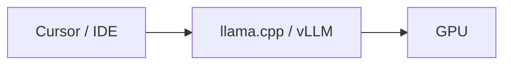
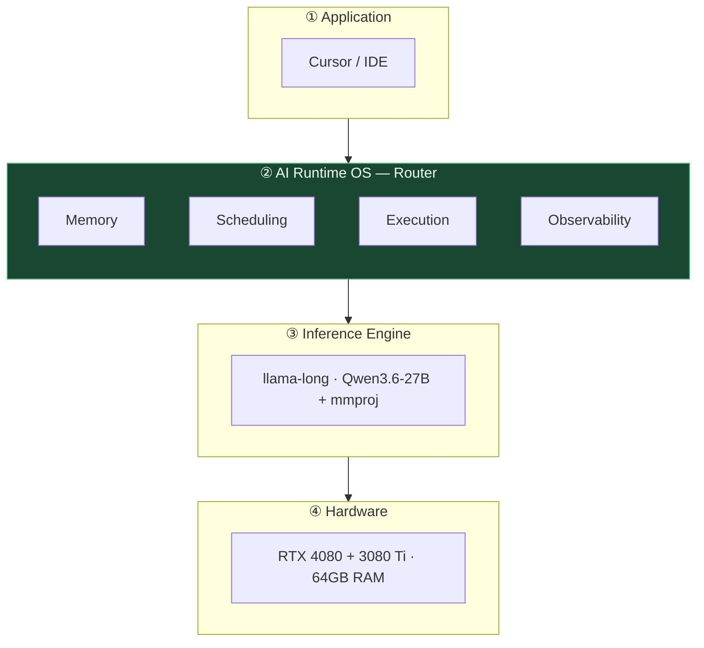
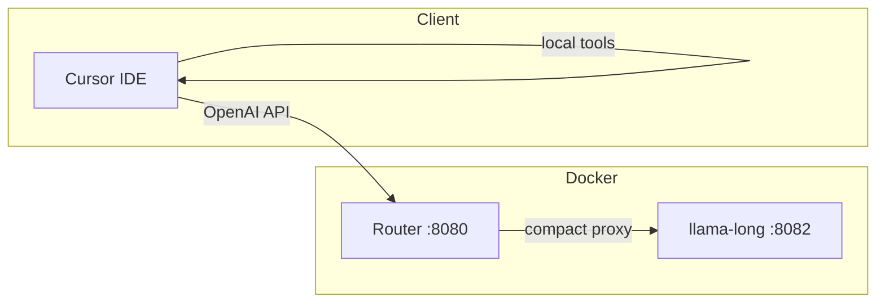
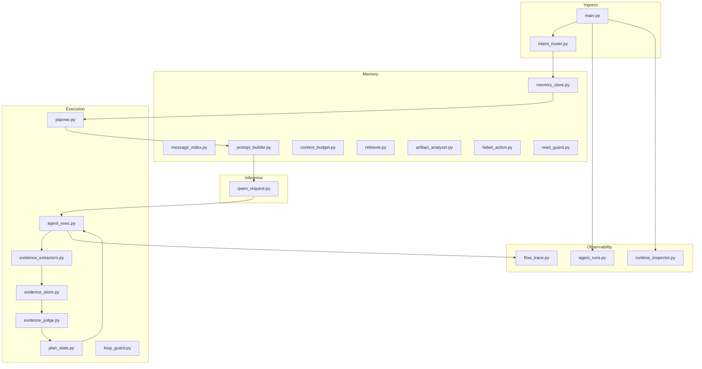
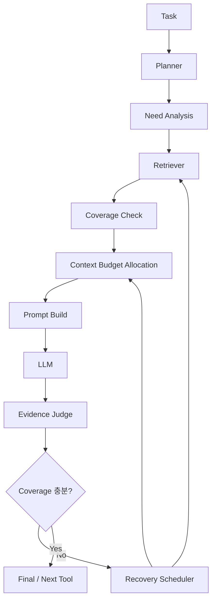
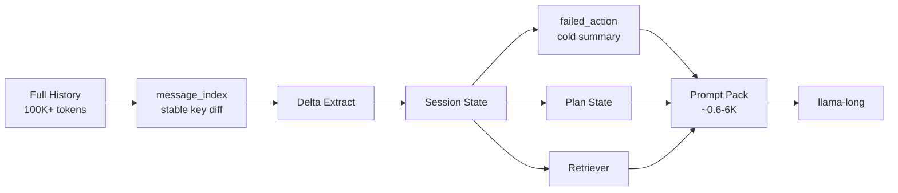
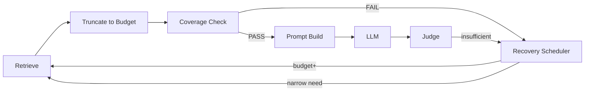
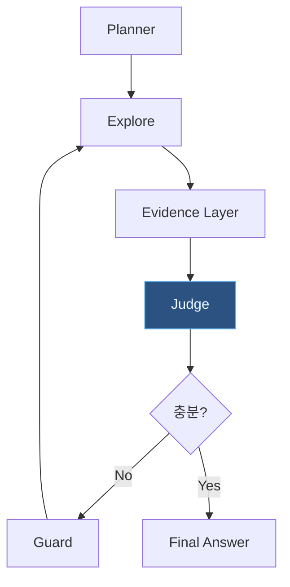
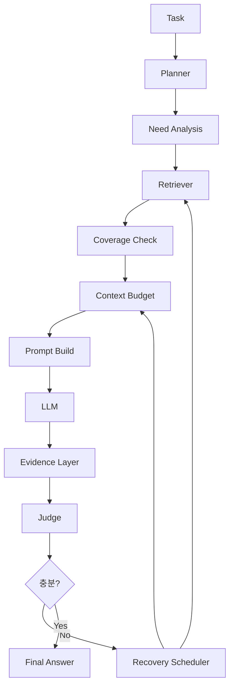
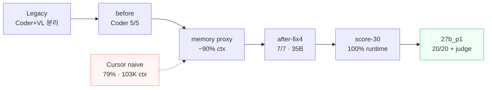

# AI Runtime OS — cursor-local-llm

> **⚠️ 아카이브 (2026-06-18)** — 제품 정의가 “AI Runtime OS”에서 **“AI Runtime / Context Runtime v1”** 로 변경되었습니다.  
> **현행 문서**: [../VISION.md](../VISION.md)

---

> **로컬 AI를 위한 실행 런타임**
>
> **현재**: Cursor + llama.cpp 환경에서 Memory · Context · Agent 실행 계층을 검증하는 **참조 구현 POC**
>
> **지향**: Plan · Evidence · Retrieval 결과에 따라 Budget을 매 요청 재계산하는 **AI Runtime OS**

| | |
|---|---|
| **역할** | Application과 Inference Engine 사이의 **AI Runtime OS** |
| **클라이언트** | Cursor (BYOK / custom endpoint) |
| **엔진** | llama-long — Qwen3.6-27B + mmproj (`qwen3_6_27b`) |
| **인터페이스** | `/v1/chat/completions` (OpenAI 호환) + `/router/agent/runs` (SSE) |

---

## 목차

1. [비전](#1-비전)
2. [문제 정의](#2-문제-정의)
3. [아키텍처 디자인](#3-아키텍처-디자인)
4. [핵심 철학](#4-핵심-철학)
5. [Runtime Core](#5-runtime-core)
6. [구현 현황](#6-구현-현황)
7. [로드맵](#7-로드맵)
8. [경쟁 환경](#8-경쟁-환경)
9. [장기 비전](#9-장기-비전)
10. [부록](#10-부록)

**아키텍처 심화**: [§3.6 Context (POC)](#36-context-압축-설계-poc) · [§3.8 Dynamic Scheduling (목표)](#38-dynamic-scheduling-목표-아키텍처)

---

## 1. 비전

LLM 능력은 빠르게 성장하지만, **이를 실행하는 소프트웨어 스택은 거의 진화하지 못했다.**

오늘날 AI 애플리케이션은 GPU 메모리, 컨텍스트, KV cache, 모델 라우팅, 에이전트 메모리, 프롬프트 최적화를 **개발자에게 수동으로** 맡긴다. 그 결과 비싼 하드웨어는 낭비되고, 개발자는 제품이 아닌 **인프라 튜닝**에 시간을 쓴다.

**AI Runtime OS**는 Application과 Inference Engine 사이에 **새 계층**을 둔다. 작업만 전달하면 실행 계획·자원 배분·메모리·컨텍스트를 런타임이 관리한다.

**cursor-local-llm**은 이 비전의 첫 번째 참조 구현이다. Cursor를 IDE로 유지하면서, Router가 memory·planner·guard·judge·inspector를 담당한다.

**POC와 Runtime OS의 차이** — 지금은 프롬프트 압축·agent 안정화에 집중한 **POC** 단계다. 장기적으로 Budget은 "설정값"이 아니라 **Plan과 Evidence에 따라 매 요청 재계산되는 실행 정책**이어야 한다. ([§3.8](#38-dynamic-scheduling-목표-아키텍처))

---

## 2. 문제 정의

### 2.1 오늘의 스택



> Application이 Engine에 직접 붙는다. 중간에 워크로드를 관리하는 계층이 없다.

### 2.2 실제 증상

| 증상 | 원인 |
|------|------|
| 100K+ history → OOM | 컨텍스트 무한 성장 |
| Read 반복 루프 | plan/state 부재, HTML stub만 전달 |
| Agent loop 중단 | stream/tool_call 포맷 불일치 |
| 48턴 ping-pong | 조기 final + XML leak + evidence 부재 |
| VRAM 꽉 참 (35B MoE) | weights ~28GB → KV 슬롯 없음 |

---

## 3. 아키텍처 디자인

### 3.1 네 계층

비전의 핵심: **Runtime이 Engine 위에 하나 더 생긴다.**



| 계층 | 하는 일 | 하지 않는 일 |
|------|---------|--------------|
| **Application** | 작업 정의, UI, **로컬 tool 실행** | VRAM·ctx·agent phase |
| **AI Runtime OS** | memory, scheduling, execution, observability | 텐서 연산 |
| **Inference Engine** | forward, sampling, tool_call 파싱 | history 압축, evidence gate |
| **Hardware** | 연산·저장 | 실행 정책 |

### 3.2 Runtime 네 역할

| 역할 | 설계 의도 | 주요 모듈 |
|------|-----------|-----------|
| **Memory** | LLM이 전부 기억하지 않게, 런타임이 기억 관리 | `memory_store.py`, `retriever.py`, `artifact_analyzer.py` |
| **Scheduling** | phase·context·generation budget 분배 | `context_budget.py` (정적), `plan_state.py`, `intent_router.py` → **동적 Scheduler로 확장 예정** ([§3.8](#38-dynamic-scheduling-목표-아키텍처)) |
| **Execution** | plan → explore → evidence → judge → guard → final | `planner.py`, `evidence_judge.py`, `agent_exec.py` |
| **Observability** | turn 단위 plan/phase/evidence 추적 | `flow_trace.py`, `agent_runs.py`, `runtime_inspector.py` |

### 3.3 배포 토폴로지



**Legacy** (폐기 방향): Router → long (Coder UD-Q4_K_XL) + **vl** (Qwen3-VL Q4_K_M) + fast — VRAM 중복, vision은 vl 서버로 라우팅

**Unified** (운영): Router → **llama-long ONLY** (27B + mmproj, fast/vl OFF)

```text
Cursor → Router (planner + guard + memory + judge + inspector)
              → llama-long (Qwen3.6-27B UD-Q4_K_XL + mmproj)
                    ├─ /v1/chat/completions
                    └─ /router/agent/runs/{id}/events (SSE)
```

### 3.4 모듈 맵

Router(`router/`) 내부 설계. Application은 OpenAI API만 호출하고, 아래 모듈은 전부 Runtime 내부.



| 모듈 | 설계 책임 |
|------|-----------|
| `main.py` | OpenAI API 진입, stream 정책, inspector 주입 |
| `memory_store.py` | session, delta, artifact, `agent_plan` 영속 |
| `message_index.py` | stable key, append-only diff, ingest metrics |
| `failed_action.py` | 실패 tool result → cold policy summary |
| `read_guard.py` | 대용량 Read 차단, Grep/jq/range 대안 |
| `context_budget.py` | `allocate_static` / **`allocate_dynamic`** → `BudgetPlan` (절대 토큰) |
| `context_need.py` | **신규** `ContextNeed` 스키마 + intent preset 5종 |
| `dynamic_context_scheduler.py` | **신규** Need → Retrieve → Budget → Prompt → Coverage |
| `coverage_checker.py` | **신규** must_include / target / truncation 검사 |
| `recovery_scheduler.py` | **신규** coverage FAIL 시 budget bump + re-retrieve |
| `planner.py` | AgentPlan JSON — intent, evidence, next_action |
| `retriever.py` | query/delta 점수 기반 artifact 로드 → Retrieval Scheduler 입력 |
| `answer_tokens.py` | final_answer 모드별 max_tokens (Token Scheduler POC 일부) |
| `prompt_builder.py` | state+delta+artifact → compact proxy (~0.6–6K) |
| `plan_state.py` | phase 결정, executor guard |
| `evidence_judge.py` | batch sufficiency 판단 + coverage 신호 (확장 예정) |
| *(목표)* `schedulers/` | Intent · Context · Retrieval · Token · Recovery Scheduler |
| `loop_guard.py` | ping-pong, final 1회/turn, XML leak |
| `agent_exec.py` | tool_call 검증, leak 복구, stream=false |
| `agent_runs.py` | SDK 호환 run event SSE |
| `runtime_inspector.py` | chat `<details>` Runtime Snapshot |

환경 변수·검증 명령: [ARCHITECTURE.md](./ARCHITECTURE.md)

### 3.5 요청 파이프라인

#### POC (현재 구현)

한 번의 chat completion이 Router 안에서 거치는 단계.

```text
[1]  Cursor IN              full history (Router만 수신)
[2]  message_index          stable key diff (append-only | rebuild)
[3]  memory_store           delta / artifact / session / agent_plan
[4]  failed_action          실패 tool → cold summary (large_file 등)
[5]  planner                AgentPlan (rule | llm | hybrid)
[6]  agent_runs             begin_run (run_id = flow_id)
[7]  context_budget         phase별 **정적 비율** 할당 (POC)
[8]  retriever              query/delta 점수 기반 artifact 로드
[9]  prompt_builder         [Saved Agent Plan] + artifact tail proxy
[10] read_guard             validate_tool_call (대용량 Read 대안)
[11] qwen_request           phase별 thinking / sampling kwargs
[12] llama-long             inference
[13] agent_exec             guard, normalize, leak recovery
[14] evidence layer         tool result → tag + EvidenceItem
[15] evidence_judge         static pre-eval → LLM judge → guard
[16] plan_state             phase: tool_planning | final_answer (event)
[17] runtime_inspector      chat content `<details>` 주입
[18] agent_runs             tool / evidence / status events
[19] Cursor                 local tool exec → history append → loop
```

#### Runtime OS (목표 파이프라인)

Budget을 **먼저** 고정하지 않고, Planner → Retrieval → Coverage → Allocation 순으로 결정.



```text
Task → Planner → Need Analysis → Retriever → Coverage Check
     → Context Budget Allocation → Prompt Build → LLM
     → Evidence Judge → (부족 시) Budget 증가 → Re-Retrieve → Prompt Rebuild
```

### 3.6 Context 압축 설계 (POC)

Cursor가 100K+ history를내도 LLM에는 proxy만 전달.

**핵심**: Cursor history는 Router만 수신. LLM에는 `state + delta + artifact summary`만 전달.



| 계층 | Hot (매 turn) | Cold (요약·정책) |
|------|---------------|------------------|
| 메시지 | delta + artifact tail | message_keys snapshot |
| 컨텍스트 | context_index incremental | rebuild on key mismatch |
| 실패 정책 | `[failed_tool_actions]` block | `failed_tool_summaries` |
| Phase | event-driven `PhaseState` | full-scan fallback |

#### 정적 Budget (현재 — `context_budget.py`)

POC에서는 구현 단순성을 위해 **phase별 고정 비율**을 사용한다. 32K ctx에서 output·safety를 뺀 뒤 슬롯을 나눈다.

| 슬롯 | tool_planning | final_answer |
|------|:-------------:|:------------:|
| system + plan | 10% | 6% |
| state | 12% | 8% |
| delta | 8% | 6% |
| retrieved | 8% | 18% |
| session_tail | 12% | 42% |
| task | 50% | 20% |

**한계** — 고정 비율은 대부분의 질문에 최적이 아니다.

| 질문 유형 | 필요한 슬롯 | 정적 Budget 문제 |
|-----------|-------------|------------------|
| "2주 전 planner 구조 기억나?" | session/history ↑ | session_tail 12%로 부족할 수 있음 |
| "이 문서 분석해" | retrieved/document ↑ | state 12%는 낭비일 수 있음 |
| "버그 수정" | code/retrieved ↑ | history 비중 과다 |

> ctx를 키우기(262K/YaRN)보다 **보내는 양을 줄이기**. 운영 ctx **32K**로 충분 — 단, **슬롯 비율은 질문마다 달라져야** 한다 ([§3.8](#38-dynamic-scheduling-목표-아키텍처)).

### 3.8 Dynamic Scheduling (목표 아키텍처)

Budget은 **설정값이 아니라 실행 정책**이다. Planner · Retriever · Evidence Judge · Scheduler가 **폐쇄 루프(closed loop)** 를 이룬다.

#### Scheduling 계층 (목표)

```text
Scheduling
├── Intent Scheduler        작업 종류·intent 분석
├── Context Scheduler       Context Budget 동적 계산
├── Retrieval Scheduler     Retriever 예산·우선순위
├── Token Scheduler         Generation Budget (max_tokens, thinking)
├── Memory Scheduler        Long-term / Session / Artifact 계층
├── GPU Scheduler           VRAM / KV / Tensor Split
├── Phase Scheduler         Planning / Explore / Judge / Final
└── Recovery Scheduler      Budget 부족·Coverage FAIL 시 재분배
```

| Scheduler | 입력 | 출력 |
|-----------|------|------|
| **Intent** | user query, AgentPlan | task_kind, evidence_needed |
| **Context** | retrieval 결과, plan, phase | 슬롯별 token ceiling |
| **Retrieval** | need list, artifact index | ranked chunks + 실제 token 수 |
| **Token** | phase, intent, modality | max_output, temperature, thinking |
| **Recovery** | coverage &lt; threshold | budget ↑, re-retrieve, prompt rebuild |

#### Context Budget — Plan·Retrieval 기반 동적 재분배

**순서**: Budget 먼저 ❌ → **Need → Retrieve → Measure → Allocate** ✅

```text
Planner: Need = [planner.py, memory_store, benchmark]
Retriever: planner 1200 + memory 800 + benchmark 600 = 2600 tokens
Context Scheduler:
  Retrieved  2600
  History     500
  State       300
  Task        200
  (합 ≤ 32K − output − safety)
```

질문 유형별 **예시** (목표 정책 — 구현 전 설계):

| 질문 | History | Session | Retrieved | Code/Doc | State | Task |
|------|:-------:|:-------:|:---------:|:--------:|:-----:|:----:|
| 버그 수정 | 5% | — | 45% | 40% | 5% | 5% |
| 아까 뭐 이야기했지? | 60% | 25% | 0% | — | 10% | 5% |
| 논문 요약 | 0% | — | — | 70% | 5% | 25% |

#### Generation Budget — phase·intent별 동적

항상 `max_tokens=4096`일 필요 없다.

| Phase / Intent | max_output | thinking | 비고 |
|----------------|:----------:|:--------:|------|
| tool_planning | ~300 | 많음 | tool_call JSON 위주 |
| final_answer | ~3000 | 거의 없음 | prose stream |
| code_edit | ~1200 | 중간 | temperature 낮음 |
| vision | ~500 | — | image token 별도 예약 |

현재 POC: `answer_tokens.py`가 final_answer 모드별 토큰을 일부 분기. **Token Scheduler**로 통합 예정.

#### Coverage Check — truncate 후 검증

Retriever가 6000 tokens를 가져왔는데 Budget이 3000이면 **절반은 잘린다**. 대부분의 시스템은 잘라버리기만 한다. Runtime OS는 **잘렸는지 안다**.

```text
planner.py (12000 tokens)
  → Budget ceiling 4000
  → truncate (method 4개 누락)
  → Coverage Check: 62% — FAIL
  → Recovery Scheduler: budget ↑ 또는 second retrieval (grep/symbol/section)
```

검사 항목 (목표):

| 신호 | 의미 |
|------|------|
| **Coverage** | 필요한 evidence 대비 프롬프트에 포함된 비율 |
| **Completeness** | 파일·섹션·함수 단위 누락 |
| **Missing section** | struct/class/method boundary 절단 |
| **Dependency** | import·call graph 상 필수 참조 누락 |

Judge·static pre-eval과 연동: coverage 미달 시 final 차단 + re-retrieve 루프.

#### Recovery 피드백 루프



**Recovery Scheduler** 동작 예:

1. retrieved 슬롯 +20% 재할당
2. 동일 path **section-level** 재조회 (Read → Grep symbol → range Read)
3. `prompt_source`·coverage 메트릭을 inspector/SSE에 노출

#### 구현 현황 (2026-06)

| Phase | 내용 | 상태 |
|-------|------|:----:|
| **1** | `ContextNeed` + `allocate_dynamic` + `BudgetPlan` + intent preset 5종 | ✅ |
| **2** | `retrieve_for_need` + retrieval token 측정 → budget 재분배 | ✅ |
| **3** | `coverage_checker.py` + `loop_guard` coverage 차단 | ✅ |
| **4** | `recovery_scheduler.py` + E2E bench (`benchmark-recovery-e2e.py`) | ✅ |
| **5** | Inspector Budget/Coverage/Recovery 표시 (`runtime_turn_log` + inspector) | ✅ |
| **6** | Coverage symbol·truncation·evidence 강화 | ▶ |
| — | LLM Planner `context_need` 직접 출력 + validate/merge | ▶ |
| — | Dynamic budget 회귀 벤치 20~30 케이스 | 🔲 |

환경 변수: `DYNAMIC_BUDGET=1` (기본), `COVERAGE_CHECK=1`, `RECOVERY_ENABLED=1`

검증:

```bash
python3 scripts/benchmark-dynamic-budget.py
python3 scripts/benchmark-recovery-e2e.py
```

### 3.7 Phase 설계

```text
tool_planning  →  (tool result)  →  evidence 갱신  →  judge  →  충분?
                                                              ├ No  → tool_planning
                                                              └ Yes → final_answer
```

| Phase | LLM 역할 | thinking | stream |
|-------|----------|:--------:|:------:|
| `tool_planning` | tool_call 제안 | ON | false (agent) |
| `final_answer` | prose 답변 | OFF | true |

Guard가 개입하는 경우: evidence 미충족, XML leak, ping-pong, final 중복.

---

## 4. 핵심 철학

| 원칙 | 설명 |
|------|------|
| **Task-first** | 사용자는 "무엇을 할지"만 말한다 |
| **OpenAI 호환** | IDE·에이전트를 코드 변경 없이 연결 |
| **측정 기반** | 벤치마크·flow trace로 개선 검증 |
| **Fail-safe** | static signal + LLM judge + runtime guard 3층 |
| **Budget-as-policy** | Budget은 설정이 아니라 Plan·Evidence·Coverage에 따른 **실행 정책** ([§3.8](#38-dynamic-scheduling-목표-아키텍처)) |
| **Coverage-aware** | truncate 후 잘림·누락을 검사하고, 부족하면 재조회·재분배 |

---

## 5. Runtime Core

Agent 실행의 핵심 루프. POC는 evidence gate 중심, Runtime OS는 **Scheduling 폐쇄 루프**로 확장한다.

### 5.1 POC 루프 (현재)



### 5.2 Runtime OS 루프 (목표)



| 컴포넌트 | 한 줄 |
|----------|-------|
| **Planner** | intent, evidence_needed, next_action을 AgentPlan으로 구조화 |
| **Memory** | session + delta + artifact → compact proxy |
| **Retriever** | need 기반 artifact 로드 → **실제 token 수 측정** (Budget 입력) |
| **Coverage Check** | truncate·누락·dependency 검사 — FAIL 시 Recovery |
| **Context Scheduler** | retrieval 결과를 보고 슬롯별 ceiling 동적 할당 |
| **Token Scheduler** | phase·intent별 generation budget |
| **Explore** | agent LLM이 Read/Grep/Shell 제안 → **Cursor가 실행** |
| **Evidence Layer** | collect → summarize → store (tag + EvidenceItem) |
| **Judge** | batch 단위 충분성 판단 — 실행하지 않음 |
| **Recovery Scheduler** | coverage·judge 실패 시 budget ↑, re-retrieve, prompt rebuild |
| **Guard** | phase gate, ping-pong, XML leak, Read dedup |
| **Inspector** | plan/phase/evidence/**coverage·budget** 관측 |

**Evidence Judge 3층** (설계 의도):

```text
Static pre-eval  → coverage, repeat, budget, leak (기계 신호)
LLM Judge        → “답 가능한가?” + next_actions 제안
Runtime guard    → should_block_final_answer, repeated path
```

**Coverage 4층** (목표 — Judge와 연동):

```text
Retrieval measure  → 가져온 raw token 수
Truncate audit     → budget ceiling 대비 잘린 비율
Structural check   → section/symbol/dependency 누락
Recovery action    → re-retrieve 또는 budget 재분배
```

---

## 6. 구현 현황

### 6.1 컴포넌트 상태

| 영역 | 상태 | 비고 |
|------|:----:|------|
| Memory + Context proxy | ✅ | 90% 압축 실측 |
| Incremental message index | ✅ | append-only diff, stable `tool_call_id` key |
| Failed action compaction | ✅ | large_file → grep/jq/range policy |
| Read guard + answer tokens | ✅ | P0 안정화 |
| Prompt builder canonical tail | ✅ | artifact/delta 기반, body full-scan 축소 |
| Planner + Evidence + Judge | ✅ | batch judge, loop guard |
| Agent tool_call 프로토콜 | ✅ | tool_match/json_valid 100% |
| Runtime Inspector | ✅ | Budget/Coverage/Recovery turn snapshot (`last_runtime_turn`) |
| Agent Run Trace SSE | ✅ | SDKMessage 호환, partial/TTL |
| GPU 동적 스케줄링 | 🔴 | 프로필·tensor split 수동 |
| Dynamic Context Budget | ✅ | Need → Retrieve → Budget → Prompt 파이프라인 |
| Coverage Check + Recovery | ▶ | symbol/evidence 강화 + E2E bench 통과 |
| Turn runtime log | ✅ | `runtime_turn_log.py` — flow_id, coverage, recovery, final_blocked |
| Token Scheduler (통합) | △ | `answer_tokens.py` + `BudgetPlan.output_reserved` |

### 6.2 검증된 성과

| 지표 | Cursor naive | 현재 (`qwen3_6_27b_p1`) | 개선 |
|------|:------------:|:-----------------------:|:----:|
| Runtime success | 79% | **100%** (20 tasks) | +21pp |
| Context | 103K tokens | **~10K** proxy | **−90%** |
| Tool calls / task | 3.03 | **0.6** | **−80%** |
| Task wall time | 13.9s | **2.8–3.9s** | **−72~80%** |

변천사·전체 수치: [§10.2](#102-벤치마크-변천사) · [BENCHMARK.md](./BENCHMARK.md)

### 6.3 Architecture Changes

| Before | After | Why |
|--------|-------|-----|
| 35B MoE 기본 | **27B dense** | KV 슬롯 확보 (~9GB 여유) |
| 262K / YaRN | **32K** | proxy 압축 |
| fast + vl 동시 | **unified long** | VRAM 중복 제거 |
| keyword → phase | **AgentPlan + evidence gate** | 조기 final 방지 |
| HTML blind truncate | **artifact_analyzer** | 재Read 루프 방지 |
| full history re-hash | **message_index incremental** | 60-turn+ 세션 scan 감소 |
| raw error loop | **failed_action cold summary** | large_file 정책 힌트 |
| body tail full-scan | **artifact tail proxy** | prompt_builder canonical |
| 정적 context 비율 | **Dynamic Scheduler** (목표) | Plan·Retrieval·Coverage 기반 재분배 |
| final XML 승격 | **승격 금지** | ping-pong 방지 |
| Cursor = planner | **Runtime planner + ReAct** | structured plan + guard |

**운영 프로필**: `qwen3_6_27b` — 27B + mmproj, 32K ctx, tensor split 43/57, VRAM KV.

---

## 7. 로드맵

| Phase | 내용 | 상태 |
|-------|------|:----:|
| **0 POC** | Memory, proxy, agent, evidence gate | ✅ |
| **1 안정화** | P0 guard + incremental index + failed_action | ▶ |
| **1.5 UX** | Inspector 확장, context·budget 시각화 | ▶ |
| **2 Scheduling** | Dynamic Context/Token Scheduler, Coverage Check, Recovery loop | 🔲 |
| **2.5 GPU** | GPU Scheduler, KV Manager, VRAM telemetry | 🔲 |
| **3 플랫폼** | Engine HAL, Multi-GPU, SDK, Enterprise | 🔲 |

**Phase 1 완료 (2026-06)**: intent 오분류 수정, Read guard, partial run TTL, incremental message index, failed_action compaction, prompt_builder artifact tail.

**Phase 1 미완**: Agent Run E2E, `PLANNER_MODE=llm` 벤치, 27B Cursor 60-turn replay 벤치, progress UI.

**Phase 2 Scheduling (핵심)** — POC 정적 Budget을 Runtime 정책으로 승격:

1. **Context Scheduler** — Retriever 실측 token → 슬롯 동적 할당
2. **Token Scheduler** — phase·intent·modality별 generation budget
3. **Coverage Check** — truncate·section·dependency 검사
4. **Recovery Scheduler** — FAIL 시 budget ↑, re-retrieve, prompt rebuild
5. Inspector/SSE에 `coverage%`, `budget_allocation`, `prompt_source` 노출

**Phase 2.5 예정**: GPU/VRAM live telemetry, Replay drill-down, Runtime Database.

---

## 8. 경쟁 환경

> IDE나 Engine을 대체하지 않는다. **Cursor 아래 실행 품질을 끌어올리는 런타임 레이어.**

| 차별성 | 설명 |
|--------|------|
| **Context 운영** | 103K → ~0.6K proxy, measured 90% 압축 |
| **Dynamic Budget** (목표) | Plan·Retrieval·Coverage 기반 매 요청 재분배 — 정적 POC를 넘어섬 |
| **Agent 안정화** | evidence gate + loop guard + judge |
| **관측 내장** | Inspector (chat) + agent_runs (SSE) |
| **BYOK 호환** | OpenAI API 유지, 내부 정책만 교체 |

| 제품 | Context | Memory | Agent Runtime | IDE |
|------|:-------:|:------:|:-------------:|:---:|
| Cursor | △ | △ | ❌ | ✅ |
| LangGraph | △ | ✅ | △ | ❌ |
| llama.cpp | ❌ | ❌ | ❌ | ❌ |
| **AI Runtime OS** | ✅ | ✅ | △ | ❌ (Cursor 조합) |

---

## 9. 장기 비전

오늘의 OS는 애플리케이션을 관리한다. 내일은 **지능 자체**를 관리하는 소프트웨어가 필요하다.

> "어떤 GPU를 살까?" → "이 작업 실행해줘"

**Runtime OS가 되려면** — 프롬프트 압축 POC를 넘어, 매 요청마다 **Intent · Context · Retrieval · Token · Memory · GPU · Phase · Recovery** Scheduler가 협력해 자원을 재배분해야 한다. Budget은 설정 파일이 아니라 **현재 작업의 목적과 확보된 정보량을 반영하는 실행 정책**이다.

```text
단순 압축기  →  POC (현재)
실행 관리자  →  Runtime OS (목표)
```

비즈니스: Enterprise On-Premise Runtime, AI Runtime SDK, Management Console.

---

## 10. 부록

### 10.1 설계 인사이트

**왜 32K ctx로 충분한가** — state+delta+plan proxy로 ~0.6–6K만 전달. ctx 확장보다 보내는 양 축소가 효과적. 다만 **슬롯 비율은 질문마다 달라야** 하므로 정적 Budget은 POC 한계다 ([§3.8](#38-dynamic-scheduling-목표-아키텍처)).

**왜 Budget을 동적으로 해야 하는가** — "2주 전 planner 기억나?"와 "이 문서 분석해"는 필요한 history·retrieved·document 비중이 정반대다. Retriever가 가져온 실측 token을 보고 할당하는 것이 자연스럽다.

**왜 Coverage Check가 필요한가** — truncate는 필연적으로 정보를 잘라낸다. Runtime은 잘렸는지 알고, 부족하면 re-retrieve 또는 budget을 올려야 한다. 그렇지 않으면 "답은 했지만 근거가 잘린" 위험한 답변이 나온다.

**왜 Planner를 넣었는가** — intent별 evidence 요구를 AgentPlan으로 구조화. Judge/Guard가 일관되게 검증. 장기적으로 Planner 출력이 **Need Analysis → Retrieval Scheduler**의 입력이 된다.

**왜 Judge는 실행하지 않는가** — explore=agent LLM, 검증=Runtime, tool 실행=Cursor. 역할 분리로 루프·환각·과탐색 방지.

### 10.2 벤치마크 변천사

*원본: `tmp/benchmark-*.json` · 측정: 2026-06-18*

#### 한눈에 — 무엇이 바뀌었나



#### 모델·인프라 변천 (정확한 식별자)

| Era | 프로필 | 정확한 모델 | 양자화 | 서버 토폴로지 | ctx | weights | gen tok/s |
|-----|--------|------------|--------|--------------|:---:|:-------:|:---------:|
| **Legacy** | `qwen3_coder` | `Qwen3-Coder-30B-A3B-Instruct` | **UD-Q4_K_XL** | long + **vl** + fast | 200K | — | **51.3** (long) |
| Legacy VL | (vl 서버) | `Qwen3-VL-30B-A3B-Instruct` | **Q4_K_M** | llama-vl :8083 | 4K~32K | — | **168** (4K) / **27.1** (32K KV) |
| before | `qwen3_coder` | 동일 Coder | UD-Q4_K_XL | legacy + proxy | ~734 | — | **32.7** |
| Unified 35B | `qwen3_6` | `Qwen3.6-35B-A3B` | **UD-Q4_K_M** | long only | 32K | **~28GB** | 15.7–22 |
| Unified 27B ★ | `qwen3_6_27b` | `Qwen3.6-27B` | **UD-Q4_K_XL** | long only | 32K | **~17.6GB** | **28.6–35.2** |
| **P1 현재** | `qwen3_6_27b_p1` | 27B + mmproj | UD-Q4_K_XL | + judge/guard | ~638 | 17.6GB | **24.6** |

mmproj: `mmproj-F16.gguf` (35B·27B unified). 27B tensor split **43,57**, KV **VRAM**.

#### 핵심 지표 (시작 → 현재)

| 지표 | Cursor naive | Legacy Coder | after-fix4 (35B) | **27b_p1 (현재)** |
|------|:------------:|:------------:|:----------------:|:-----------------:|
| Runtime success | 79% | — | — | **100%** |
| Context | 103,560 | ~734 | ~578 | **~10K proxy** |
| Tool calls / task | 3.03 | — | — | **0.6** |
| Task time | 13.9s | 1.5s† | 2.3s† | **2.8–3.9s** |
| Agent pass | — | 5/5 | **7/7** | **6/6** |
| gen tok/s | — | 32.7 (agent) / 51.3 (raw) | 15.7 | **24.6–35.2** |
| leaks | 다수 | 0 | 0 | **0** |

† agent case 평균 wall time

#### 마일스톤 × 아키텍처

| 단계 | 변경 | 벤치 결과 |
|------|------|-----------|
| Legacy | Coder long + **VL 별도 서버** | VL 168 tok/s, Coder 51 tok/s, tool 3/5 |
| before | Coder UD-Q4_K_XL + agent 정규화 | **5/5** tool_match 100% |
| memory proxy | state+delta + prompt_builder | ctx **−90%** |
| after-qwen36 | **35B** UD-Q4_K_M unified | agent 5/6, json 100% |
| after-fix4 | plan_state + evidence gate + analyzer | **7/7**, vision 100% |
| score-30 | 30-task runtime suite | success **79→100%** |
| qwen3_6_27b | **27B** UD-Q4_K_XL, VRAM KV | weights 28→17.6GB, gen **+60%** |
| **qwen3_6_27b_p1** | planner + judge + loop guard | **20/20**, agent 6/6 |

#### Agent 변천 (요약)

| 라벨 | 프로필 | 모델 (양자화) | 통과 | tool_match | json | vision | leaks | gen t/s |
|------|--------|--------------|:----:|:----------:|:----:|:------:|:-----:|:-------:|
| before | qwen3_coder | Coder **Q4_K_XL** | 5/5 | 100% | — | — | 0 | 32.7 |
| after-qwen36 | 35B MoE | **Q4_K_M** | 5/6 | 100% | 100% | — | 0 | 17.2 |
| after-fix3 | 35B | Q4_K_M | 6/7 | 100% | 100% | 100% | 0 | 14.3 |
| **after-fix4** | 35B | Q4_K_M | **7/7** | 100% | 100% | 100% | 0 | 15.7 |
| qwen3_6_27b | 27B | **Q4_K_XL** | 6/7 | 100% | 100% | 100% | 1 | 28.6 |
| **qwen3_6_27b_p1** | 27B | Q4_K_XL | **6/6** | 100% | 100% | — | 0 | 24.6 |

#### Runtime Score 변천

| run | tasks | success (naive→runtime) | tools | time (ms) | passed |
|-----|:-----:|:-----------------------:|:-----:|:---------:|:------:|
| score-30 | 30 | 79% → **100%** | 3.03 → 0.6 | 13913 → 2752 | 30/30 |
| score-100 | 100 | 79% → **99%** | 3.1 → 0.61 | 12383 → 2437 | 99/100 |
| qwen3_6_27b | 20 | 79% → 85% | 3.1 → 0.75 | 20120 → 4868 | 17/20 |
| **qwen3_6_27b_p1** | 20 | 79% → **100%** | 3.1 → 0.6 | 20326 → 3934 | **20/20** |

#### Context 압축

| 케이스 | Cursor tokens | 압축률 |
|--------|:-------------:|:------:|
| 실제 세션 (289 msgs) | 103,560 | **90.2%** |
| 50턴 synthetic | 7,707 → 488 | 93.0% |
| agent proxy | 2,844 → 991 | 72.5% |

#### 현재 운영 프로필 & 게이트

`qwen3_6_27b` — `Qwen3.6-27B-UD-Q4_K_XL.gguf` + `mmproj-F16.gguf` · **UD-Q4_K_XL** · 32K ctx · tensor split 43/57 · VRAM KV

| 게이트 | 목표 | 달성 |
|--------|------|:----:|
| Runtime score | ≥ 95% | **100%** (20 tasks) |
| tool_match / json_valid | 100% | ✅ |
| xml leaks | 0 | ✅ |
| vision | 100% | ✅ |

전체 표·재현 명령: [BENCHMARK.md](./BENCHMARK.md)

```bash
python3 scripts/benchmark-cursor-agent.py --label qwen3_6_27b_p1
python3 scripts/benchmark-runtime-score.py --tasks 30
```

---

## 관련 문서

| 문서 | 내용 |
|------|------|
| [ARCHITECTURE.md](./ARCHITECTURE.md) | 환경 변수, API, 검증 체크리스트 |
| [BENCHMARK.md](./BENCHMARK.md) | 벤치마크 (독립 참조) |
| [WORKSPACE_LAYOUT.md](./WORKSPACE_LAYOUT.md) | 디렉토리·워크스페이스 |
| [VISION.html](./VISION.html) | 브라우저용 HTML (`scripts/export-vision-html.sh`) |

---

*Last updated: 2026-06-18 — Dynamic Scheduling 목표 아키텍처, POC vs Runtime OS 구분*
