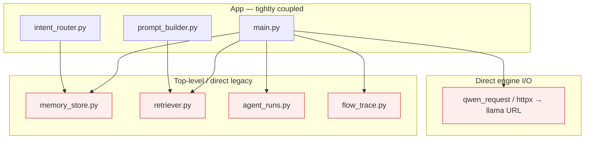
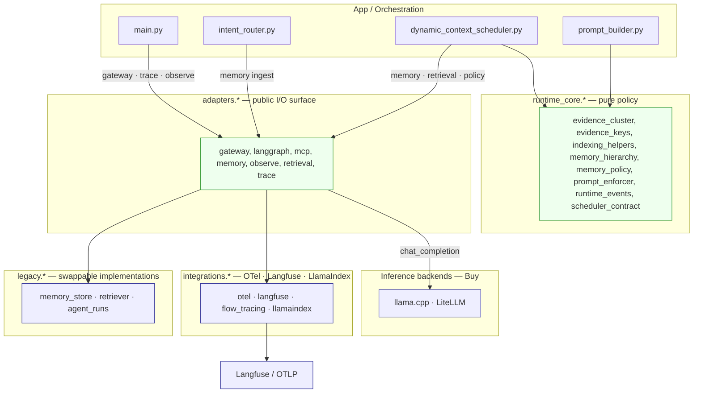
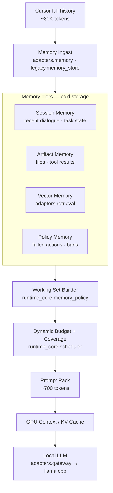

# Dependency Graph — Before / After

> Generated: `2026-06-21T09:34:03Z` · `python3 scripts/generate-dependency-graph.py`

## Message

**Before:** app code was coupled to legacy modules and direct engine HTTP.

**After:** app calls `adapters.*` for I/O; `runtime_core` is pure policy; legacy/integrations/backends are swappable.

## Verification snapshot

| Check | Result |
|-------|--------|
| Architecture boundary violations | **0** |
| `runtime_core` → adapters/legacy/integrations imports | **0** |
| `main.py` → `legacy.*` direct imports | **0** |
| `main.py` → removed top-level shims | **0** |
| `main.py` → `adapters.*` imports | `adapters.gateway`, `adapters.observe`, `adapters.trace` |
| Orchestration → legacy (non-allowlist) | **0** ✅ |

Layer edges: orchestration→adapters **6** · adapters→legacy **4** · adapters→integrations **3**

## Before — monolithic app + legacy + direct engine



Top-level shims `memory_store.py` / `retriever.py` / `agent_runs.py` / `flow_trace.py` are **removed**.

## After — adapters + runtime_core + isolated legacy



Source: [`assets/dependency-after.mmd`](./assets/dependency-after.mmd)

## Memory Hierarchy path (Local LLM differentiator)



Source: [`assets/memory-hierarchy.mmd`](./assets/memory-hierarchy.mmd)

### Benchmark summary

| case | raw | prompt_pack | gpu_context | ratio | coverage | hit_rate | re-read avoid |
|------|-----|-------------|-------------|-------|----------|----------|---------------|
| bugfix | 0 | 1,093 | 1,093 | 0.0000 | 1.00 | 1.00 | 1.00 |
| explore | 0 | 1,270 | 1,270 | 0.0000 | 1.00 | 1.00 | 1.00 |

> **Compression proved** (~80K → ~700 tokens). **Quality gate next**: coverage ≥ 0.8 + task_success ≥ 95% (`--quality-gate`).

## CI verification

```bash
python3 scripts/check-architecture-boundary.py
python3 scripts/generate-dependency-graph.py --verify
python3 scripts/test-architecture-boundary.py
```

## Module layers

| Layer | Role | Build/Buy |
|-------|------|-----------|
| `runtime_core/` | MemoryPolicy · hierarchy · scheduler events | **Build IP** |
| `adapters/` | memory · retrieval · gateway · trace · observe | **Adapter surface** |
| `legacy/` | file-backed memory · BM25 retriever | **Swappable** |
| `integrations/` | OTel · Langfuse · LlamaIndex | **Buy glue** |
| Inference | llama.cpp · LiteLLM | **Buy** |
